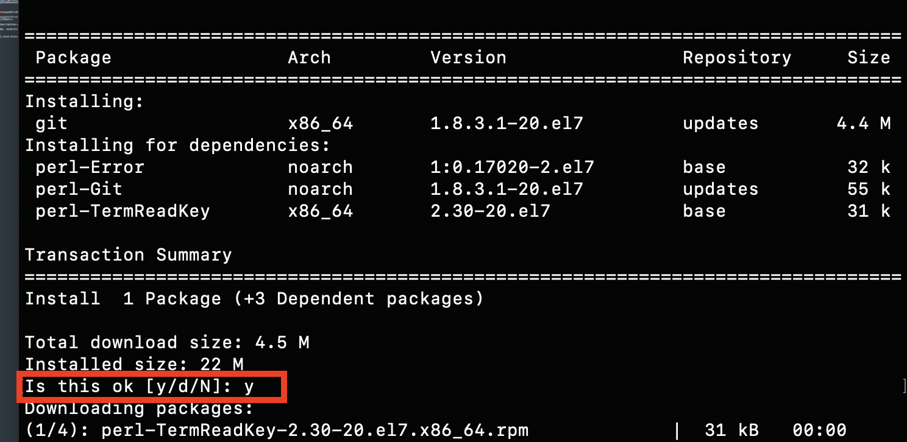
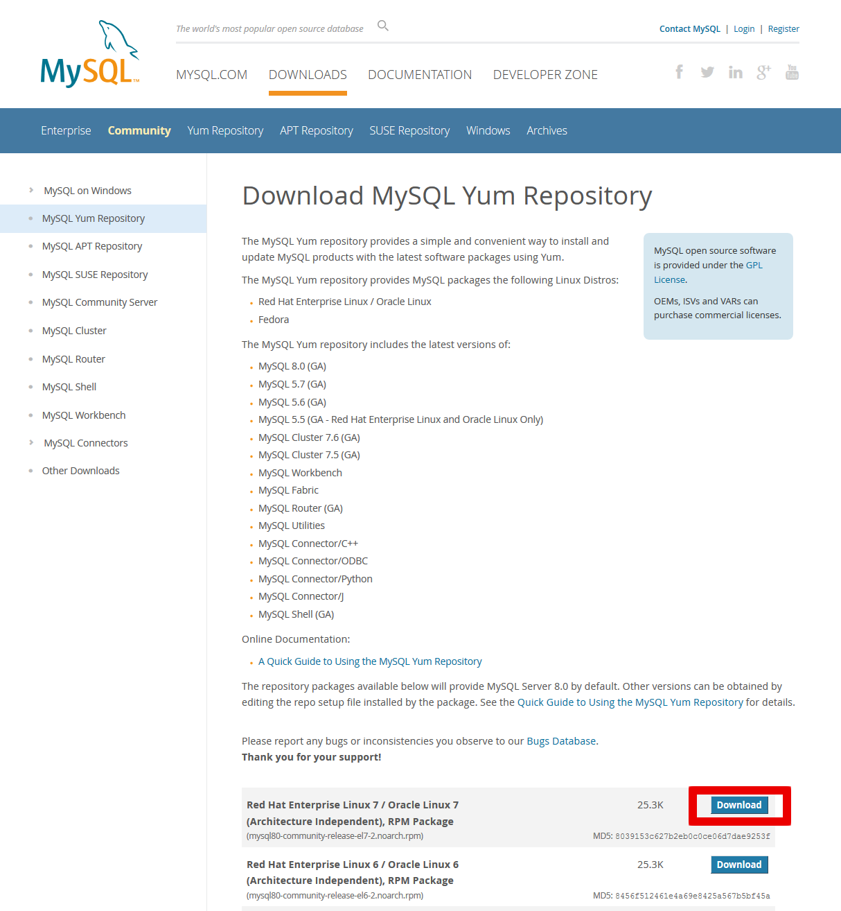
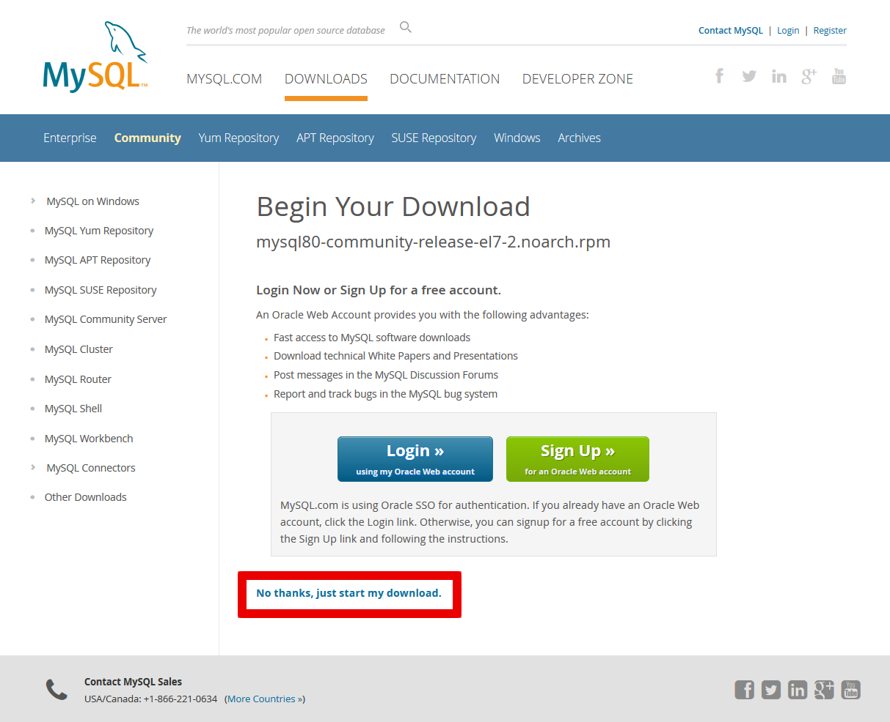

# (17)CentOSの準備

この章からは、実際にアプリをデプロイするための作業に入ります。</br>

デプロイとは、アプリケーションが、ネットワーク上で利用できるようにすることを指します。</br>  

ソースが正しくても、サーバー上だとキチンと動かないこともあります。それは、環境が違うからです。</br>

環境を含めて、WEBアプリを利用できるようにすることを業界用語でデプロイと言うわけです。</br>

この教材でのデプロイは、生徒の皆さんがHerokuへのデプロイも経験済み、という前提で、AWSのEC2インスタンスを新たに本番環境として利用すること、を想定して行っていきます。</br></br>

開発環境とは違い、本番環境にするだけで、アプリの設定などに追加作業が出てきますので、注意が必要です。</br>

Herokuへのデプロイに苦労をされた方もいらっしゃると思いますが、一から本番環境を構築するのは、なかなか大変な作業です。</br>
作業を進めていくにつれ、Cloud9やHerokuというのは便利なサービスだったんだな、とわかって頂けることと思います。</br>

また、AWSのインスタンスとしてのCentOSと、いわゆるホスティングなどで借りる素のCentOSを比べると、AWSのインスタンスの方が、部分的に自動化されている機能があります。</br>
素のCentOSをセッティングする場合は、この教材以上の作業が必要になる、ということも、覚えておいて下さい。</br>


## 公開対象のアプリについて

この教材でデプロイするのは、TechBoostのベーシックタームで作成したお馴染みのアプリです。</br>
PHPはmynews、Rubyはpictgramを公開します。</br>
生徒の皆さんが作成したオリジナルアプリを公開する場合の参考になるよう配慮はしますが、各自の実装機能などにより、追加の作業が発生するかもしれません。</br>
その点は、各自で読み替えて、追加の作業が必要であれば、ご自分で調べて作業を進めていって下さい。</br>

前置きが長くなってしまいました。</br>
それでは、本番環境の構築を、一緒にやっていきましょう。</br>


## 本章の目的：CentOSでアプリを公開するための準備を行う

- CentOSは開発、テスト、本番の各環境でもよく使われるサーバーOSです。
- ここでは、各言語に共通するアプリケーションのインストールと設定を行います。
- RubyやPHPのアプリを公開するための準備を行いましょう。


### yumのアップデート

まず最初に、CentOSのアプリケーション管理ツールであるyumをアップデートします。

```
$ sudo yum update
```

### wgetのインストール

インターネット上のファイルをダウンロードするアプリケーションです。

```
$ sudo yum install wget
```

### SELinuxの設定

CentOSのファイヤウォールであるSELinuxをpassiveモードに設定します。

```
$ sudo setenforce 0
```

### Gitのインストール
まず、インストールの確認

```
git --version

//===
-bash: git: command not found
```

のように表示されるとインストールされていません。
環境を作るのは,cloud9とは違い大変です。

#### それでは、実際にGitをインストールしましょう。
```
$ sudo yum install git
```
yumでインストールすると依存関係のパッケージもインストールされるので、便利です。


依存関係のダウンロードが完了すると

```
Is this ok [y/d/N]:   
```

と聞いて来ますので yと入力してあげましょう。これは毎回同じ作業になります。

ちなみに本家サイトもきちんと読みましょうね！  

このテキストのとおりにいかないときは、本家サイトを調べると問題が解決します。

本家サイトを調べる習慣をつけましょう！  


https://git-scm.com/book/ja/v1/%E4%BD%BF%E3%81%84%E5%A7%8B%E3%82%81%E3%82%8B-Git%E3%81%AE%E3%82%A4%E3%83%B3%E3%82%B9%E3%83%88%E3%83%BC%E3%83%AB


#### インストールされたかの確認です。
バージョンが表示されればインストールされているということです。

```
$ git --version

//==
git version 1.8.3.1
```
このようにバージョンが表示されるとインストールされているということです。
これはインストールするたびに習慣づけましょう。


## nvm(node.js)のインストール

nvmとはnode.jsのバージョン管理ツールです。</br>
node.jsとはサーバー側で動くJavaScriptのことです。</br>
node.jsがインストールされていないと、他のパッケージがインストールできなかったり、
railsなどのコマンドがうまく動いてくれないので、サーバー側では必須のパッケージです。</br>
PHPとLaravelでも、laravel-mixのインストールに利用します。</br>

ホームディレクトリで
```
$ curl -o- https://raw.githubusercontent.com/creationix/nvm/v0.34.0/install.sh | bash
```

#### nvmへのパスを通します

bashrcに書き込まれてしまったので、最後の一文を
以下を.bash_profileに書き加えます。

#### その前にvi の基本操作を教えます。

ファイルを開くときは
```
vi ファイル名
```
カーソルで移動して、修正したい箇所がありましたら i を押します
insertの略です。  

それで編集モードになります。  

抜けるときは
- 1-ESCキーを押します。
- 2-:コロンを押します　カーソルが左下に移動します
- 保存して終了するときは
- wq  書き込んで　write 終わり quit
- 間違えたので保存せずに終了するときは  q!
!は強制の意味です。  

#### では.bash_profileを編集しましょう

```
vi ~/.bash_profile
```
表示されたら下記の3行を加えましょう。

```
export NVM_DIR="$HOME/.nvm"
[ -s "$NVM_DIR/nvm.sh" ] && \. "$NVM_DIR/nvm.sh"  # This loads nvm
[ -s "$NVM_DIR/bash_completion" ] && \. "$NVM_DIR/bash_completion"
```

```
$ source ~/.nvm/nvm.sh
$ echo 'source ~/.nvm/nvm.sh' >> .bash_profile
$ nvm --version

//==
0.34.0
```


バージョンが表示されたら成功です。

#### インストール可能な Node.js のバージョン一覧を表示します

```
$ nvm ls-remote

//==

v10.15.0   (LTS: Dubnium)
v10.15.1   (LTS: Dubnium)
v10.15.2   (LTS: Dubnium)
v10.15.3   (LTS: Dubnium)
v10.16.0   (Latest LTS: Dubnium)
```
#### node.jsは奇数が開発版で偶数が安定版です。

#### LTS は実務向けの安定版ということです。

この場合v10.16.0 をインストールします。（各自の環境構築時期により、異なります。）

```
$ nvm install v10.16.0

$node -v

//==
v10.16.0
```

#### デフォルトのバージョンを決めておきます。

```
$ nvm alias default v10.16.0

//==
default -> v10.16.0
```


### MySQLのインストールと設定

今回は5系最新版の5.7をインストールします。

#### インストールされているものの確認
まずは、既にインストールされいるmysqlがあるかを確認しましょう。

バージョン確認
```
$ mysql --version
-bash: mysql: command not found
```
上記は、インストールされていない場合の表示です。<br>
もし、5.7以外のバージョンがインストールされていた場合、
以下のコマンドでアンインストールしておきましょう。

```
$ sudo yum remove ［インストール済みのmysqlモジュール名］
```

#### インストール可能なmysqlのリストを確認する
では、インストール可能なmysqlを調べましょう。

```
$ yum list | grep mysql
apr-util-mysql.x86_64                  1.6.1-5.amzn2.0.2              amzn2-core
dovecot-mysql.x86_64                   1:2.2.10-8.amzn2.0.2           amzn2-core
freeradius-mysql.x86_64                3.0.13-9.amzn2                 amzn2-core
libdbi-dbd-mysql.x86_64                0.8.3-16.amzn2.0.1             amzn2-core
mysql-connector-java.noarch            1:5.1.25-3.amzn2               amzn2-core
mysql-connector-odbc.x86_64            5.2.5-7.amzn2                  amzn2-core
pcp-pmda-mysql.x86_64                  3.12.2-5.amzn2                 amzn2-core
php-mysql.x86_64                       5.4.16-43.amzn2                amzn2-core
php-mysqlnd.x86_64                     5.4.16-45.amzn2.0.6            amzn2-core
qt-mysql.i686                          1:4.8.5-15.amzn2.0.3           amzn2-core
qt-mysql.x86_64                        1:4.8.5-15.amzn2.0.3           amzn2-core
qt5-qtbase-mysql.i686                  5.9.2-3.amzn2.0.1              amzn2-core
qt5-qtbase-mysql.x86_64                5.9.2-3.amzn2.0.1              amzn2-core
redland-mysql.x86_64                   1.0.16-6.amzn2.0.1             amzn2-core
rsyslog-mysql.x86_64                   8.24.0-16.amzn2.6.1            amzn2-core
```

上記のリストには、mysql5.7が表示されていませんね。<br>
そこで、mysql5.7をインストールするための、リポジトリを追加します。


#### mysqlのリポジトリを追加する

まず、yum-utilsがインストールされているかを確認します。<br>
yum-utilsは、yumのリポジトリの有効化無効化の設定を行うためのパッケージです。

```
$ yum list installed | grep yum-utils
yum-utils.noarch                      1.1.31-46.amzn2.0.1            installed
```
yum-utilsがインストールされていますね。<br>
それでは、最新のmysqlのリポジトリを公式サイトからrpmファイルをダウンロードしてインストールします。

公式サイト
```
https://dev.mysql.com/downloads/repo/yum/
```
  
赤枠のリンクをクリックします。

  
赤枠のリンクを右クリックし、リンクをコピーします。

ターミナルで、ホームディレクトリ配下にtmpディレクトリを作成し、rpmファイルをダウンロードします。

```
$ mkdir tmp
$ cd tmp
$ wget [先ほどコピーしたrpmファイルへのリンク]
--2019-03-23 06:50:24--  https://dev.mysql.com/get/mysql80-community-release-el7-2.noarch.rpm
Resolving dev.mysql.com (dev.mysql.com)... 137.254.60.11
Connecting to dev.mysql.com (dev.mysql.com)|137.254.60.11|:443... connected.
HTTP request sent, awaiting response... 302 Found
Location: https://repo.mysql.com//mysql80-community-release-el7-2.noarch.rpm [following]
--2019-03-23 06:50:25--  https://repo.mysql.com//mysql80-community-release-el7-2.noarch.rpm
Resolving repo.mysql.com (repo.mysql.com)... 104.116.25.237
Connecting to repo.mysql.com (repo.mysql.com)|104.116.25.237|:443... connected.
HTTP request sent, awaiting response... 200 OK
Length: 25892 (25K) [application/x-redhat-package-manager]
Saving to: ‘mysql80-community-release-el7-2.noarch.rpm’

100%[==============================================================================================================>] 25,892      --.-K/s   in 0.07s

2019-03-23 06:50:25 (361 KB/s) - ‘mysql80-community-release-el7-2.noarch.rpm’ saved [25892/25892]
```

ダウンロードしたrpmファイルをローカルインストールします。

```
$ sudo yum -y localinstall [ダウンロードしたrpmファイル名]
Loaded plugins: extras_suggestions, langpacks, priorities, update-motd
Examining mysql80-community-release-el7-2.noarch.rpm: mysql80-community-release-el7-2.noarch
Marking mysql80-community-release-el7-2.noarch.rpm to be installed
Resolving Dependencies
--> Running transaction check
---> Package mysql80-community-release.noarch 0:el7-2 will be installed
--> Finished Dependency Resolution

Dependencies Resolved

========================================================================================================================================================
 Package                                   Arch                   Version                 Repository                                               Size
========================================================================================================================================================
Installing:
 mysql80-community-release                 noarch                 el7-2                   /mysql80-community-release-el7-2.noarch                  31 k

Transaction Summary
========================================================================================================================================================
Install  1 Package

Total size: 31 k
Installed size: 31 k
Downloading packages:
Running transaction check
Running transaction test
Transaction test succeeded
Running transaction
  Installing : mysql80-community-release-el7-2.noarch                                                                                               1/1
  Verifying  : mysql80-community-release-el7-2.noarch                                                                                               1/1

Installed:
  mysql80-community-release.noarch 0:el7-2

Complete!
```
これで、最新のmysqlのリポジトリが追加されました。


#### mysql5.7のリポジトリを有効化する

この時点でインストール可能なmysqlパッケージを表示してみます。

```
$ yum repolist all | grep mysql

mysql-cluster-7.5-community/x86_64   MySQL Cluster 7.5 Community disabled
mysql-cluster-7.5-community-source   MySQL Cluster 7.5 Community disabled
mysql-cluster-7.6-community/x86_64   MySQL Cluster 7.6 Community disabled
mysql-cluster-7.6-community-source   MySQL Cluster 7.6 Community disabled
mysql-connectors-community/x86_64    MySQL Connectors Community  enabled:  74+21
mysql-connectors-community-source    MySQL Connectors Community  disabled
mysql-tools-community/x86_64         MySQL Tools Community       enabled:     84
mysql-tools-community-source         MySQL Tools Community - Sou disabled
mysql-tools-preview/x86_64           MySQL Tools Preview         disabled
mysql-tools-preview-source           MySQL Tools Preview - Sourc disabled
mysql55-community/x86_64             MySQL 5.5 Community Server  disabled
mysql55-community-source             MySQL 5.5 Community Server  disabled
mysql56-community/x86_64             MySQL 5.6 Community Server  disabled
mysql56-community-source             MySQL 5.6 Community Server  disabled
mysql57-community/x86_64             MySQL 5.7 Community Server  disabled
mysql57-community-source             MySQL 5.7 Community Server  disabled
mysql80-community/x86_64             MySQL 8.0 Community Server  enabled:     82
mysql80-community-source             MySQL 8.0 Community Server  disabled
```

8.0がenabledになっていて、目的の5.7がdisabledになっていますね。<br>
これは、インストールした最新のリポジトリで、8.0だけが有効になっているからです。<br>
yum-utilsの以下のコマンドを打って、8.0を無効にし、5.7を有効にします。

```
$ sudo yum-config-manager --disable mysql80-community
$ sudo yum-config-manager --enable mysql57-community
```
mysql57が、インストール可能になったか確認してみましょう。

```
$yum list | grep mysql
mysql80-community-release.noarch       el7-2                          installed
apr-util-mysql.x86_64                  1.6.1-5.amzn2.0.2              amzn2-core
dovecot-mysql.x86_64                   1:2.2.10-8.amzn2.0.2           amzn2-core
freeradius-mysql.x86_64                3.0.13-9.amzn2                 amzn2-core
libdbi-dbd-mysql.x86_64                0.8.3-16.amzn2.0.1             amzn2-core
mysql-community-client.i686            5.7.26-1.el7                   mysql57-community
mysql-community-client.x86_64          5.7.26-1.el7                   mysql57-community
mysql-community-common.i686            5.7.26-1.el7                   mysql57-community
mysql-community-common.x86_64          5.7.26-1.el7                   mysql57-community
mysql-community-devel.i686             5.7.26-1.el7                   mysql57-community
mysql-community-devel.x86_64           5.7.26-1.el7                   mysql57-community
mysql-community-embedded.i686          5.7.26-1.el7                   mysql57-community
mysql-community-embedded.x86_64        5.7.26-1.el7                   mysql57-community
mysql-community-embedded-compat.i686   5.7.26-1.el7                   mysql57-community
mysql-community-embedded-compat.x86_64 5.7.26-1.el7                   mysql57-community
mysql-community-embedded-devel.i686    5.7.26-1.el7                   mysql57-community
mysql-community-embedded-devel.x86_64  5.7.26-1.el7                   mysql57-community
mysql-community-libs.i686              5.7.26-1.el7                   mysql57-community
mysql-community-libs.x86_64            5.7.26-1.el7                   mysql57-community
mysql-community-libs-compat.i686       5.7.26-1.el7                   mysql57-community
mysql-community-libs-compat.x86_64     5.7.26-1.el7                   mysql57-community
mysql-community-release.noarch         el7-7                          mysql57-community
mysql-community-server.x86_64          5.7.26-1.el7                   mysql57-community
mysql-community-test.x86_64            5.7.26-1.el7                   mysql57-community
mysql-connector-c++.x86_64             8.0.15-1.el7                   mysql-connectors-community
mysql-connector-c++-devel.x86_64       8.0.15-1.el7                   mysql-connectors-community
mysql-connector-c++-jdbc.x86_64        8.0.15-1.el7                   mysql-connectors-community
mysql-connector-java.noarch            1:5.1.25-3.amzn2               amzn2-core
mysql-connector-odbc.x86_64            5.2.5-7.amzn2                  amzn2-core
mysql-connector-odbc-debuginfo.x86_64  8.0.15-1.el7                   mysql-connectors-community
mysql-connector-odbc-setup.x86_64      8.0.15-1.el7                   mysql-connectors-community
mysql-connector-python.noarch          2.0.4-1.el7                    mysql-connectors-community
mysql-connector-python.x86_64          8.0.15-1.el7                   mysql-connectors-community
mysql-connector-python-cext.x86_64     8.0.15-1.el7                   mysql-connectors-community
mysql-connector-python-debuginfo.x86_64
                                       2.1.7-1.el7                    mysql-connectors-community
mysql-ref-manual-5.5-en-html-chapter.noarch
                                       1-20170320                     mysql57-community
mysql-ref-manual-5.5-en-pdf.noarch     1-20170320                     mysql57-community
mysql-ref-manual-5.7-en-html-chapter.noarch
                                       1-20181224                     mysql57-community
mysql-ref-manual-5.7-en-pdf.noarch     1-20181224                     mysql57-community
mysql-router.x86_64                    8.0.12-1.el7                   mysql-tools-community
mysql-router-community.x86_64          8.0.15-1.el7                   mysql-tools-community
mysql-router-debuginfo.x86_64          8.0.12-1.el7                   mysql-tools-community
mysql-shell.x86_64                     8.0.15-1.el7                   mysql-tools-community
mysql-shell-debuginfo.x86_64           8.0.15-1.el7                   mysql-tools-community
mysql-utilities.noarch                 1.6.5-1.el7                    mysql-tools-community
mysql-utilities-extra.noarch           1.5.6-1.el7                    mysql-tools-community
mysql-workbench-community.x86_64       8.0.15-1.el7                   mysql-tools-community
mysql-workbench-community-debuginfo.x86_64
                                       8.0.15-1.el7                   mysql-tools-community
mysql57-community-release.noarch       el7-10                         mysql57-community
pcp-pmda-mysql.x86_64                  3.12.2-5.amzn2                 amzn2-core
php-mysql.x86_64                       5.4.16-43.amzn2                amzn2-core
php-mysqlnd.x86_64                     5.4.16-45.amzn2.0.6            amzn2-core
qt-mysql.i686                          1:4.8.5-15.amzn2.0.3           amzn2-core
qt-mysql.x86_64                        1:4.8.5-15.amzn2.0.3           amzn2-core
qt5-qtbase-mysql.i686                  5.9.2-3.amzn2.0.1              amzn2-core
qt5-qtbase-mysql.x86_64                5.9.2-3.amzn2.0.1              amzn2-core
redland-mysql.x86_64                   1.0.16-6.amzn2.0.1             amzn2-core
rsyslog-mysql.x86_64                   8.24.0-16.amzn2.6.1            amzn2-core

```

リストから、8系のcommunityの主なパッケージが消え、5.7の主なパッケージが表示されていますね。<br>
インストールの対象は、どのバージョンでもmysql-community-serverです。<br>
どのリポジトリを有効にするかによって、インストールするバージョンが切り替わるということです。


#### mysql5.7をインストール

それでは、mysql5.7をインストールします。

```
$ sudo yum -y install mysql-community-server mysql-community-devel

Loaded plugins: extras_suggestions, langpacks, priorities, update-motd
amzn2-core                                                                                                                       | 2.4 kB  00:00:00
mysql-connectors-community                                                                                                       | 2.5 kB  00:00:00
mysql-tools-community                                                                                                            | 2.5 kB  00:00:00
mysql57-community                                                                                                                | 2.5 kB  00:00:00
mysql57-community/x86_64/primary_db                                                                                              | 170 kB  00:00:00
21 packages excluded due to repository priority protections
Resolving Dependencies
--> Running transaction check
---> Package mysql-community-server.x86_64 0:5.7.26-1.el7 will be installed
--> Processing Dependency: mysql-community-common(x86-64) = 5.7.26-1.el7 for package: mysql-community-server-5.7.26-1.el7.x86_64
--> Processing Dependency: mysql-community-client(x86-64) >= 5.7.9 for package: mysql-community-server-5.7.26-1.el7.x86_64
--> Running transaction check
---> Package mysql-community-client.x86_64 0:5.7.26-1.el7 will be installed
--> Processing Dependency: mysql-community-libs(x86-64) >= 5.7.9 for package: mysql-community-client-5.7.26-1.el7.x86_64
--> Processing Dependency: libtinfo.so.5()(64bit) for package: mysql-community-client-5.7.26-1.el7.x86_64
--> Processing Dependency: libncurses.so.5()(64bit) for package: mysql-community-client-5.7.26-1.el7.x86_64
---> Package mysql-community-common.x86_64 0:5.7.26-1.el7 will be installed
--> Running transaction check
---> Package mariadb-libs.x86_64 1:5.5.60-1.amzn2 will be obsoleted
--> Processing Dependency: libmysqlclient.so.18()(64bit) for package: 2:postfix-2.10.1-6.amzn2.0.3.x86_64
--> Processing Dependency: libmysqlclient.so.18(libmysqlclient_18)(64bit) for package: 2:postfix-2.10.1-6.amzn2.0.3.x86_64
---> Package mysql-community-libs.x86_64 0:5.7.26-1.el7 will be obsoleting
---> Package ncurses-compat-libs.x86_64 0:6.0-8.20170212.amzn2.1.2 will be installed
--> Running transaction check
---> Package mysql-community-libs-compat.x86_64 0:5.7.26-1.el7 will be obsoleting
--> Finished Dependency Resolution

Dependencies Resolved

========================================================================================================================================================
 Package                                     Arch                   Version                                     Repository                         Size
========================================================================================================================================================
Installing:
 mysql-community-libs                        x86_64                 5.7.26-1.el7                                mysql57-community                 2.2 M
     replacing  mariadb-libs.x86_64 1:5.5.60-1.amzn2
 mysql-community-libs-compat                 x86_64                 5.7.26-1.el7                                mysql57-community                 2.0 M
     replacing  mariadb-libs.x86_64 1:5.5.60-1.amzn2
 mysql-community-server                      x86_64                 5.7.26-1.el7                                mysql57-community                 165 M
Installing for dependencies:
 mysql-community-client                      x86_64                 5.7.26-1.el7                                mysql57-community                  24 M
 mysql-community-common                      x86_64                 5.7.26-1.el7                                mysql57-community                 274 k
 ncurses-compat-libs                         x86_64                 6.0-8.20170212.amzn2.1.2                    amzn2-core                        314 k

Transaction Summary
========================================================================================================================================================
Install  3 Packages (+3 Dependent packages)

Total download size: 194 M
Downloading packages:
warning: /var/cache/yum/x86_64/2/mysql57-community/packages/mysql-community-common-5.7.26-1.el7.x86_64.rpm: Header V3 DSA/SHA1 Signature, key ID 5072e1f5: NOKEY
Public key for mysql-community-common-5.7.26-1.el7.x86_64.rpm is not installed
(1/6): mysql-community-common-5.7.26-1.el7.x86_64.rpm                                                                            | 274 kB  00:00:00
(2/6): mysql-community-libs-5.7.26-1.el7.x86_64.rpm                                                                              | 2.2 MB  00:00:00
(3/6): mysql-community-libs-compat-5.7.26-1.el7.x86_64.rpm                                                                       | 2.0 MB  00:00:00
(4/6): ncurses-compat-libs-6.0-8.20170212.amzn2.1.2.x86_64.rpm                                                                   | 314 kB  00:00:00
(5/6): mysql-community-client-5.7.26-1.el7.x86_64.rpm                                                                            |  24 MB  00:00:02
(6/6): mysql-community-server-5.7.26-1.el7.x86_64.rpm                                                                            | 165 MB  00:00:09
--------------------------------------------------------------------------------------------------------------------------------------------------------
Total                                                                                                                    19 MB/s | 194 MB  00:00:10
Retrieving key from file:///etc/pki/rpm-gpg/RPM-GPG-KEY-mysql
Importing GPG key 0x5072E1F5:
 Userid     : "MySQL Release Engineering <mysql-build@oss.oracle.com>"
 Fingerprint: a4a9 4068 76fc bd3c 4567 70c8 8c71 8d3b 5072 e1f5
 Package    : mysql80-community-release-el7-2.noarch (installed)
 From       : /etc/pki/rpm-gpg/RPM-GPG-KEY-mysql
Running transaction check
Running transaction test
Transaction test succeeded
Running transaction
  Installing : mysql-community-common-5.7.26-1.el7.x86_64                                                                                           1/7
  Installing : mysql-community-libs-5.7.26-1.el7.x86_64                                                                                             2/7
  Installing : ncurses-compat-libs-6.0-8.20170212.amzn2.1.2.x86_64                                                                                  3/7
  Installing : mysql-community-client-5.7.26-1.el7.x86_64                                                                                           4/7
  Installing : mysql-community-server-5.7.26-1.el7.x86_64                                                                                           5/7
  Installing : mysql-community-libs-compat-5.7.26-1.el7.x86_64                                                                                      6/7
  Erasing    : 1:mariadb-libs-5.5.60-1.amzn2.x86_64                                                                                                 7/7
  Verifying  : mysql-community-libs-5.7.26-1.el7.x86_64                                                                                             1/7
  Verifying  : mysql-community-common-5.7.26-1.el7.x86_64                                                                                           2/7
  Verifying  : mysql-community-server-5.7.26-1.el7.x86_64                                                                                           3/7
  Verifying  : mysql-community-client-5.7.26-1.el7.x86_64                                                                                           4/7
  Verifying  : ncurses-compat-libs-6.0-8.20170212.amzn2.1.2.x86_64                                                                                  5/7
  Verifying  : mysql-community-libs-compat-5.7.26-1.el7.x86_64                                                                                      6/7
  Verifying  : 1:mariadb-libs-5.5.60-1.amzn2.x86_64                                                                                                 7/7

Installed:
  mysql-community-libs.x86_64 0:5.7.26-1.el7     mysql-community-libs-compat.x86_64 0:5.7.26-1.el7     mysql-community-server.x86_64 0:5.7.26-1.el7

Dependency Installed:
  mysql-community-client.x86_64 0:5.7.26-1.el7   mysql-community-common.x86_64 0:5.7.26-1.el7   ncurses-compat-libs.x86_64 0:6.0-8.20170212.amzn2.1.2

Replaced:
  mariadb-libs.x86_64 1:5.5.60-1.amzn2

Complete!
```

インストールされたmysqlのバージョンを確認しましょう。

```
$ mysql --version
mysql  Ver 14.14 Distrib 5.7.26, for Linux (x86_64) using  EditLine wrapper
```

5.7.26がインストールされていますね。<br>
ここまでは順調です。


#### mysqlの起動確認

以下のコマンドで、mysqlを起動し、起動を確認してみましょう。

```
$ sudo systemctl start mysqld
$ systemctl status mysqld

● mysqld.service - MySQL Server
   Loaded: loaded (/usr/lib/systemd/system/mysqld.service; enabled; vendor preset: disabled)
   Active: inactive (dead) since Mon 2019-03-25 13:50:45 UTC; 1min 40s ago
     Docs: man:mysqld(8)
           http://dev.mysql.com/doc/refman/en/using-systemd.html
  Process: 5088 ExecStart=/usr/sbin/mysqld --daemonize --pid-file=/var/run/mysqld/mysqld.pid $MYSQLD_OPTS (code=exited, status=0/SUCCESS)
  Process: 5015 ExecStartPre=/usr/bin/mysqld_pre_systemd (code=exited, status=0/SUCCESS)
 Main PID: 5092 (code=exited, status=0/SUCCESS)

Mar 25 12:23:42 ip-172-31-220-174.ap-northeast-1.compute.internal systemd[1]: Starting MySQL Server...
Mar 25 12:23:46 ip-172-31-220-174.ap-northeast-1.compute.internal systemd[1]: Started MySQL Server.
Mar 25 13:50:44 ip-172-31-220-174.ap-northeast-1.compute.internal systemd[1]: Stopping MySQL Server...
Mar 25 13:50:45 ip-172-31-220-174.ap-northeast-1.compute.internal systemd[1]: Stopped MySQL Server.
```

正常に起動できていますね！<br>
では試しに接続してみましょう。

```
$ mysql -u root

ERROR 1045 (28000): Access denied for user 'root'@'localhost' (using password: NO)
```

パスワード無しのログインは拒否されてしまいました。

実は、mysql5.7.26ではインストール時にランダムにrootのパスワードが設定されてしまいます。<br>
また、パスワードは大文字英字、小文字英字、数字と特殊文字を全て使わねばなりません。<br>
これでは不便ですから、mysqlを自由にカスタマイズ出来るよう、パスワードをリセットする手順をご紹介します。<br>
ついでに、よくあるtimestampの設定と、文字化けを防ぐ為の文字コードの設定もやってしまいましょう。


#### mysqlのパスワードリセットと初期設定

まずは、my.cnfというmysqlの設定ファイルを探します。<br>
探すときは find コマンドを利用します。

```
$ sudo find / -name my.cnf | grep my.cnf

//==  
sudo 権限で　find 探します　どこ？　/ルート以下 -name 名前は？ my.cnf です。その結果はたくさん表示されます。
なので grep して my.cnf 含む文字列を表示してください
というメソッドになります。
| 縦の棒はパイプと言って、メソッドをつなげることが出来ます。いくらでも出来ます。


//==　ここにありました。
/etc/my.cnf

```

#### my.cnfの編集前にMySQlを一旦停止させましょう
my.cnfファイルを変更できないためです。

```
$ sudo systemctl stop mysqld

```

#### my.cnfを編集します
先程の場所へ移動して
my.cnfの所有者はroot なのでsudo を付けます
```
cd /etc
sudo vi my.cnf
```

#### 変更前
```
# For advice on how to change settings please see
# http://dev.mysql.com/doc/refman/5.7/en/server-configuration-defaults.html

[mysqld]
#
# Remove leading # and set to the amount of RAM for the most important data
# cache in MySQL. Start at 70% of total RAM for dedicated server, else 10%.
# innodb_buffer_pool_size = 128M
#
# Remove leading # to turn on a very important data integrity option: logging
# changes to the binary log between backups.
# log_bin
#
# Remove leading # to set options mainly useful for reporting servers.
# The server defaults are faster for transactions and fast SELECTs.
# Adjust sizes as needed, experiment to find the optimal values.
# join_buffer_size = 128M
# sort_buffer_size = 2M
# read_rnd_buffer_size = 2M
datadir=/var/lib/mysql
socket=/var/lib/mysql/mysql.sock

# Disabling symbolic-links is recommended to prevent assorted security risks
symbolic-links=0

log-error=/var/log/mysqld.log
pid-file=/var/run/mysqld/mysqld.pid
```
#### 変更後

```
# For advice on how to change settings please see
# http://dev.mysql.com/doc/refman/5.7/en/server-configuration-defaults.html

[mysqld]
#
# Remove leading # and set to the amount of RAM for the most important data
# cache in MySQL. Start at 70% of total RAM for dedicated server, else 10%.
# innodb_buffer_pool_size = 128M
#
# Remove leading # to turn on a very important data integrity option: logging
# changes to the binary log between backups.
# log_bin
#
# Remove leading # to set options mainly useful for reporting servers.
# The server defaults are faster for transactions and fast SELECTs.
# Adjust sizes as needed, experiment to find the optimal values.
# join_buffer_size = 128M
# sort_buffer_size = 2M
# read_rnd_buffer_size = 2M
datadir=/var/lib/mysql
socket=/var/lib/mysql/mysql.sock

# Disabling symbolic-links is recommended to prevent assorted security risks
symbolic-links=0

log-error=/var/log/mysqld.log
pid-file=/var/run/mysqld/mysqld.pid

//===ここから
# タイムスタンプの初期設定
explicit_defaults_for_timestamp = 1

# サーバー側の文字コード設定
character-set-server=utf8

# パスワードの有効期限を恒久化(デフォルトでは360日)
default_password_lifetime = 0

# パスワードポリシーを無効化
#validate-password = OFF  ←ここはコメントアウトしておきます

# 一時的にデータベースへの権限を無効にしてmysqlを起動できるようにする
skip-grant-tables

[client]
# クライアント側の文字コード設定
default-character-set=utf8
//==ここまでを追加

```

編集後、mysqlを起動し、ログインします。

```
$ sudo systemctl start mysqld
$ mysql -u root

Welcome to the MySQL monitor.  Commands end with ; or \g.
Your MySQL connection id is 2
Server version: 5.7.26 MySQL Community Server (GPL)

Copyright (c) 2000, 2019, Oracle and/or its affiliates. All rights reserved.

Oracle is a registered trademark of Oracle Corporation and/or its
affiliates. Other names may be trademarks of their respective
owners.

Type 'help;' or '\h' for help. Type '\c' to clear the current input statement.

mysql>

```

#### mysqlコマンドを、もし間違えたときの注意点

ここで、mysqlのコマンドに操作を間違えた場合について少しだけ説明します。<br>
途中でコマンドを間違えた場合、ctl + c を2回押してリターンキーを押すと、またmysql>が表示されます。  

セミコロンが抜けていたときは、セミコロンを次の行で打てば大丈夫です。<br>
mysqlは exit; または quit; で抜けます。

それでは、実際に作業をしていきましょう。<br>
以下のコマンドを打って、rootのパスワードをリセットする準備を行います。

```
mysql> use mysql
mysql> update user set authentication_string=password('') where user='root';
mysql> flush privileges;
mysql> exit;
```

これで、パスワード無しのrootでログインはできるようになりました。<br>
しかし、まだrootのパスワードはリセットされていません。<br>
再度mysqlサービスを停止し、my.cnfを編集します。

```
$ sudo systemctl stop mysqld
$ sudo vi /etc/my.cnf

# パスワードポリシーを無効化
validate-password = OFF  ←この行のコメントアウトを外します

# 一時的にデータベースへの権限を無効にしてmysqlを起動できるようにする
#skip-grant-tables ←この行をコメントアウトします

$ sudo systemctl start mysqld
```

このような煩雑な手順を踏む理由を説明します。<br>
skip-grant-tablesのオプションで起動したmysqlには、パスワードポリシーが摘要されません。<br>
パスワードをリセットするには、skip-grant-tablesのオプションを外す必要があります。<br>
しかし、そうすると、パスワードポリシーが摘要されてしまうのです。<br>
こういう理由で、my.cnfのコメントアウトを切り替えて、パスワードリセットを行う、というわけです。

パスワードをリセットします。

```
$ mysql -u root

Welcome to the MySQL monitor.  Commands end with ; or \g.
Your MySQL connection id is 2
Server version: 5.7.26

Copyright (c) 2000, 2019, Oracle and/or its affiliates. All rights reserved.

Oracle is a registered trademark of Oracle Corporation and/or its
affiliates. Other names may be trademarks of their respective
owners.

Type 'help;' or '\h' for help. Type '\c' to clear the current input statement.

mysql> alter user 'root'@'localhost' identified with mysql_native_password by '{PW}';
mysql> flush privileges;
mysql> set password='';
mysql> quit;
```

これでパスワードのリセットは完了です。<br>
再度mysqlにパスワード無しのrootでログインし、文字コードを確認してみましょう。

```
$ mysql -u root
mysql> show variables like "chara%";
+--------------------------+----------------------------+
| Variable_name            | Value                      |
+--------------------------+----------------------------+
| character_set_client     | utf8                       |
| character_set_connection | utf8                       |
| character_set_database   | utf8                       |
| character_set_filesystem | binary                     |
| character_set_results    | utf8                       |
| character_set_server     | utf8                       |
| character_set_system     | utf8                       |
| character_sets_dir       | /usr/share/mysql/charsets/ |
+--------------------------+----------------------------+
8 rows in set (0.01 sec)
```

正しくUTF-8に設定されていますね。<br>
それでは最後に、mysqldの自動起動を有効にし、自動起動が有効になったことを確認します。

```
$ sudo systemctl enable mysqld
$ systemctl list-unit-files -t service | grep mysqld.service
mysqld.service                                enabled

```

#### MySQLのソケットファイルの確認
ソケットファイルとは、MySQLに接続するために使われる、通信用ファイルです。ポート番号などの情報を含んでいます。

#### ソケットファイルを探します。

ファイルを探すコマンドはfind  です。  
|(縦棒、パイプと呼びます,キーボード右上の¥マークのところにあるキーになります。）  

パイプ以下は検索結果の中から mysql.sockを含むものを表示してくださいという意味です
```
$ sudo find / -name mysql.sock | grep mysql.sock

//===これをメモしておきましょう あとでRailsの設定のときに利用します。
/var/lib/mysql/mysql.sock

```

お疲れ様でした！</br>
これで、CentOSの準備は完了です。</br>
次章から、Rubyのpictgramアプリを公開します。PHPのアプリを公開する方は、20章へ進んで下さい。
