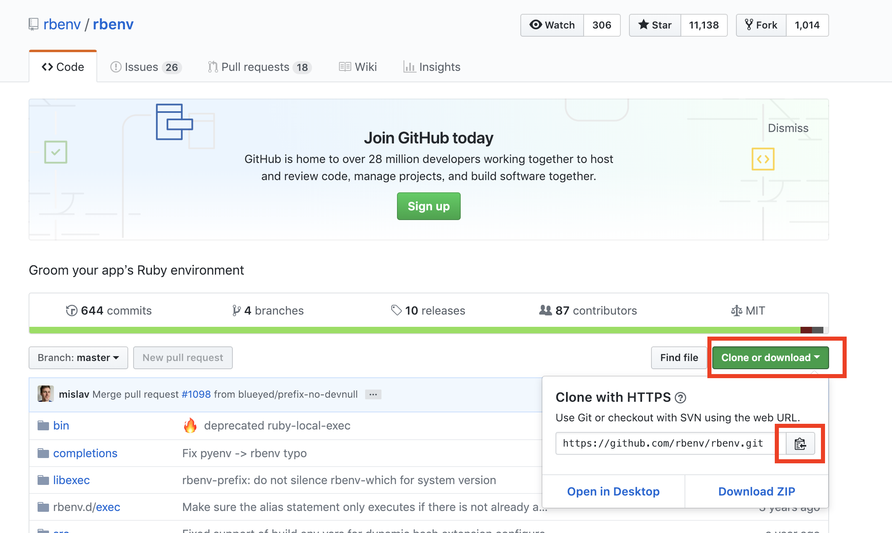
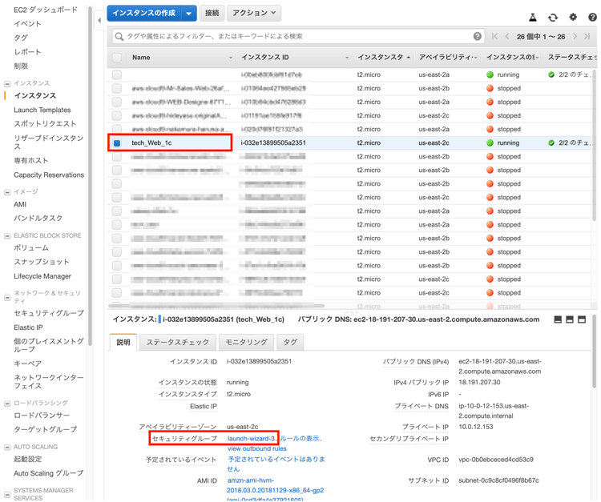
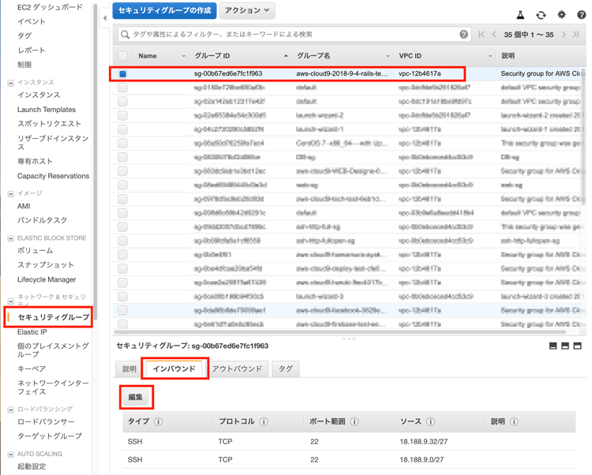
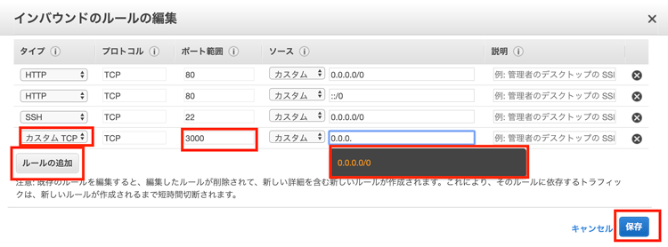
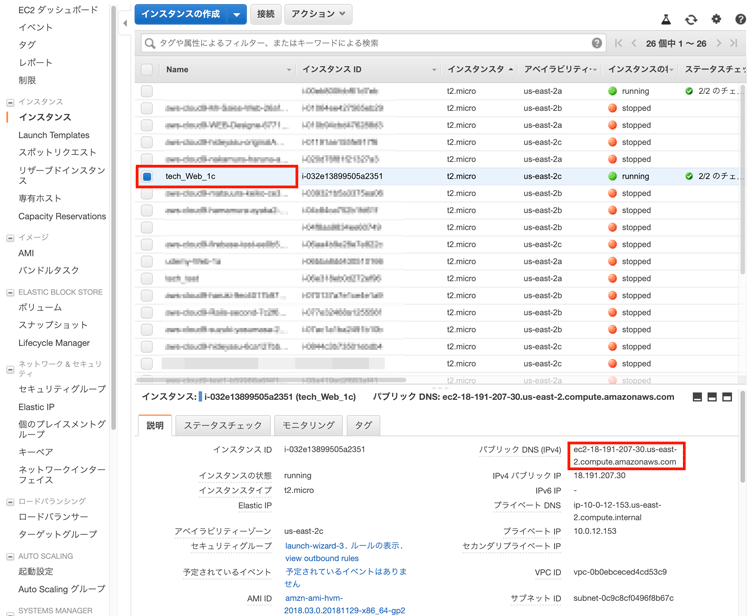
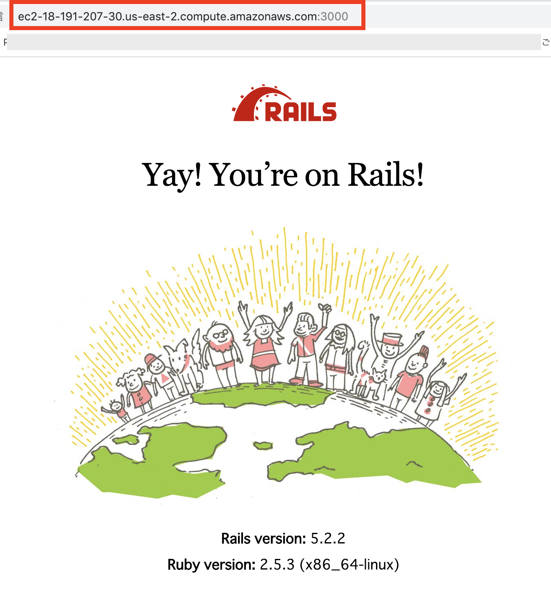

# (18)Rubyのインストール

## 本章の目的：RubyとRailsのインストール

- rbenvにより構築したRubyにrailsをインストールする。
- bundler,Rails,Rubyとgemの整理。
- Railsアプリをとりあえず作成する方法をやってみます。


## 本章の目的：サーバーに必要なパッケージのインストールと特定のRubyバージョンのインストール  


- RubyとRailsの環境を構築する-それまでにいろんなものをインストールする必要があります。
- AWSはCentOSというLinuxですので、yumでインストールします。依存関係のパッケージをを入れてくれるので便利です。
- Rubyのインストールをします。Rubyのインストールには、古いrubyの削除、rbenvというrubyのバージョン管理ツールのインストール、そしてrbenvによるRubyのインストールが含まれます。


いよいよ今回から自分のアプリケーションをデプロイして行く準備をします。  

デプロイとはWEB上に公開すると言うことですね。  

WEBで公開するために、IPアドレスを取得したり、VPC仮想ネットワークを前章までで作ってきました。  


### Rubyインストールに必要なパッケージのインストール

#### Rubyインストールに必要なパッケージをインストールします

```
$ sudo yum groupinstall "Development Tools"

$ sudo yum install openssl-devel libssh2-devel c-ares-devel bzip2

$ sudo yum install xmlsec1-openssl-devel libxml2-devel readline-devel
```


#### fogのgemに必要なものをインストールします。
```
wget https://curl.haxx.se/download/curl-7.63.0.tar.gz

$ tar xfvz curl-7.63.0.tar.gz
$ cd curl-7.63.0
$ ./configure --enable-libcurl-option
$ make
$ sudo make install

```


## Yarnのインストール

Yarnは、Railsでのアセットのプリコンパイル等に必要なアプリケーションです。</br>
17章でインストールしたnode.js経由でインストール出来ますから、ここで一緒にインストールしてしまいましょう。

```
$ npm install -g yarn

パスを通します。
$ export PATH="$HOME/.yarn/bin:$PATH"
$ echo 'export PATH="$HOME/.yarn/bin:$PATH"' >> ~/.bash_profile
```


## Rubyのインストール
#### Rubyのバージョン確認

```
$ ruby -v
-bash: ruby: command not found
```
Rubyはインストールされていませんね。
それでは、インストールを進めていきましょう。

#### rbenvのインストール

Githubからダウンロードします。  

ここが本家サイト  

https://github.com/rbenv/rbenv


<hr>
<br />
<br />


#### gitからクローンします

```
$ git clone https://github.com/rbenv/rbenv.git ~/.rbenv

//こんな感じで表示されると思います。
[centos@ip-10-0-1-24 ~]$ git clone https://github.com/rbenv/rbenv.git ~/.rbenv
Cloning into '/home/centos/.rbenv'...
remote: Enumerating objects: 2744, done.
remote: Total 2744 (delta 0), reused 0 (delta 0), pack-reused 2744
Receiving objects: 100% (2744/2744), 515.63 KiB | 0 bytes/s, done.
Resolving deltas: 100% (1720/1720), done.
```

#### インストールしたらパスを通します。
このパスを通さないと、実際に利用できませんので、インストールしていないのと同じことになります。
大切ですね。

#### 参考サイト
https://qiita.com/Naggi-Goishi/items/2c49ea50602ea80bf015

パスは通常ユーザーフォルダの.bash_profileというファイルで管理しています。  

そこへ書き込んでおく必要があります。

```
$ echo 'export PATH="$HOME/.rbenv/bin:$PATH"' >> ~/.bash_profile
```
#### これは echo:出力しなさい >> このファイルへ（　~/.bash_profile ~/　はユーザーのデフォルト配下の)
という意味です。

通常ここへパスを通します。  

#### sourceコマンドで設定を反映します。
ウインドウズのF5キーのようなものだと思ってください。  


```
$ source .bash_profile
```

#### バージョンを確認してみましょう

```
$ rbenv -v

//==このように表示されると大丈夫です。
rbenv 1.1.2-2-g4e92322
```
#### rbenv をシェルにつなげます

```
~/.rbenv/bin/rbenv init


//==
# Load rbenv automatically by appending
# the following to ~/.bash_profile:

eval "$(rbenv init -)"
```

具体的にはこのようなことをしています。詳しく知りたい方は読んでください。  

https://github.com/rbenv/rbenv#how-rbenv-hooks-into-your-shell


#### 指示どおりにパスを通します。

```
$ echo 'eval "$(rbenv init -)"' >> ~/.bash_profile

$ source ~/.bash_profile

```

#### echo で書き出し　>>のマークはファイル場所を指します。
#### ''の中を　~/.bash_profileへ書き込んでねという意味です。  

ちなみに.bash_profileの中を確認するときちんとパスが設定されています

```
export PATH
export PATH="$HOME/.rbenv/bin:$GEM_PATH:$PATH"
eval "$(rbenv init -)"
```


#### .bash_profileを確認してみましょう。
ユーザーフォルダへは、
```
cd ~/
```
で移動できます。
	そこで
```
$ ls- la

total 16
drwx------. 5 centos centos 121 Dec 24 03:42 .
drwxr-xr-x. 3 root   root    20 Nov 26 13:39 ..
-rw-------. 1 centos centos 178 Dec 24 03:16 .bash_history
-rw-r--r--. 1 centos centos  18 Apr 11  2018 .bash_logout
-rw-r--r--. 1 centos centos 193 Apr 11  2018 .bash_profile
-rw-r--r--. 1 centos centos 231 Apr 11  2018 .bashrc
drwxrw----. 3 centos centos  19 Dec 24 03:42 .pki
drwxrwxr-x. 9 centos centos 219 Dec 24 03:42 .rbenv
drwx------. 2 centos centos  29 Nov 26 13:39 .ssh

```
.bash_profileがあるのがわかりますね。
ls -laは、ファイルを一覧表示して、権限なども表示する大切なコマンドですので、覚えておきましょう。

#### Linuxのコマンドは以下のサイト等で、勉強して下さい。

https://dotinstall.com/lessons/basic_unix_v2  

https://techacademy.jp/magazine/6406

#### .benv配下にpluginフォルダを作成します。
#### Q 上記サイトを確認して、フォルダを作成してみて下さい。

.rbenv　配下に　plugins　というフォルダを作成してみてください。


#### 答え
```
$ mkdir .rbenv/plugins
```

確認してみましょう
```
$ cd .rbenv
$ ls -la


//==こんな感じでpluginsフォルダができていると正解です。
drwxrwxr-x  2 centos centos  4096 Jan  5 08:21 libexec
-rw-rw-r--  1 centos centos  1058 Jan  5 08:21 LICENSE
drwxrwxr-x  2 centos centos  4096 Jan  5 08:25 plugins
drwxrwxr-x  3 centos centos  4096 Jan  5 08:21 rbenv.d
-rw-rw-r--  1 centos centos 18527 Jan  5 08:21 README.md
drwxrwxr-x  2 centos centos  4096 Jan  5 08:21 src
drwxrwxr-x  3 centos centos  4096 Jan  5 08:21 test
```

#### ruby-buildのインストール

rbenvを利用するといろんなバージョンのRubyが利用できます。  

いろんなバージョンのRubyをインストールするのに必須な	ruby-buildをインストールします。

```
$ git clone https://github.com/rbenv/ruby-build ~/.rbenv/plugins/ruby-build

//表示の例
Cloning into '/home/centos/.rbenv/plugins/ruby-build'...
remote: Enumerating objects: 14, done.
remote: Counting objects: 100% (14/14), done.
remote: Compressing objects: 100% (10/10), done.
remote: Total 9605 (delta 3), reused 11 (delta 2), pack-reused 9591
Receiving objects: 100% (9605/9605), 2.01 MiB | 1.83 MiB/s, done.
Resolving deltas: 100% (6291/6291), done.

```


#### rbenv-updateのインストール  

rbenvもupdateが頻繁にあります。それを簡単にupdateできるパッケージをインストールします。

本家サイト  

https://github.com/rkh/rbenv-update


```
$ git clone https://github.com/rkh/rbenv-update.git ~/.rbenv/plugins/rbenv-update
```

インストールしたらupdateします。

```
$ rbenv update

//こんなのが表示されます
Updating rbenv
Updating rbenv-update
Updating ruby-build
```


## rbenvによるRubyのインストール  

#### インストールできるRubyのバージョン一覧表示

```
$ rbenv install --list


//===
  2.4.4
  2.4.5
  2.5.0-dev
  2.5.0-preview1
  2.5.0-rc1
  2.5.0
  2.5.1
  2.5.2
  2.5.3
  2.6.0-dev
  2.6.0-preview1
  2.6.0-preview2
  2.6.0-preview3
  2.6.0-rc1
  2.6.0-rc2
```
数字だけのを見ます。  

安定版の、2.4.1をインストールします。  

devとかpreview1などは、開発版やリリース前に出される開発者向けのバージョンです。

#### Rubyのバージョンは、各自自分が作成したRubyと合わせてください。  

オリジナルアプリの公開時は、各自バージョンを読み替えて実行して下さい。

```
$rbenv install -v 2.4.1
```
しばらく時間がかかりますが、コーヒーでも飲みながら少し待ちましょう。
インストール中ですので、リターンキーなど途中で押さないようにしましょう。


最後にこのように表示されれば成功です。
```
installing rdoc:              /home/centos/.rbenv/versions/2.4.1/share/ri/2.4.0/system
installing capi-docs:         /home/centos/.rbenv/versions/2.4.1/share/doc/ruby
Installed ruby-2.4.1 to /home/centos/.rbenv/versions/2.4.1
```

インストールの確認
今回はrbenvを利用しました。  

それでrubyコマンドはこのバージョンでしか存在しませんと表示されています。

```
$ ruby -v

//===
rbenv: ruby: command not found

The `ruby' command exists in these Ruby versions:
  2.4.1
```
#### 2.4.1をグローバル化（どこでも利用できるRubyのバージョンにします。）

```
$ rbenv global 2.4.1

```

#### 設定を反映

```
$ rbenv rehash
```


#### 確認
```
$ ruby -v

//==今度はきちんと表示されました。
ruby 2.4.1p111 (2017-03-22 revision 58053) [x86_64-linux]
```

#### これでいよいよRailsをインストールする準備が整いました。
#### 次のレッスンは、Railsのインストールです。

***

### 構築したRubyの環境に、Railsを構築していきます。当然RubyのバージョンやOSのバージョンによりRailsのバージョンも異なります。

その前にbundler,Rails,Rubyとgemの整理がつかなくなってわからなくなっている方もいるかも知れません
それで簡単にまとめておきます。


#### bundlerとRailsとRubyとgemの整理

頭の中がこんがらがっているかもしれませんので、ここで整理しておきましょう。  

Rubyには、機能追加するパッケージをインストールできます。  

これがgemファイルです。  

しかし、このインストール,1つ2つなら問題ないですが、WEB開発の場合20〜30ものgemを入れたりします。
一行づつ入力するのも面倒ですし、それぞれ依存関係がありますので、微妙にバージョンも変更する必要があります。

#### そこでbundlerの登場です。　これがgemを一元管理してくれます。依存関係も把握できます。
このbundlerを利用してほとんどすべてのgemをインストールします。
Railsもgemのひとつなのです。

ですから最初、gemでインストールするのは、bundlerと railsだけです。
railsも巨大なgemなのです。
bundlerがあれば、それぞれのRailsのバージョンで、gem とバージョンをまとめて管理できます。  
<br />
例えば、Railsプロジェクトで、このWEBアプリでのgemのバージョンでは、2.3以上にしてね。
<br />
でもほかのgemは　4.2以前のgemでないとうごかないよ。
とか、便利ですね。


#### Rubyのバージョンの確認

```
$ ruby -v

//
ruby 2.4.1p111 (2017-03-22 revision 58053) [x86_64-linux]
```


#### gemをアップデートしておきます。
Railsもgemの一つの種類だからです。

```
$ gem update


//==
途中で
Overwrite the executable?
聞いてきたら y を押してください

//このように表示されたら成功です
Gems updated: bigdecimal did_you_mean io-console json minitest net-telnet openssl power_assert psych rake rdoc test-unit xmlrpc
```


#### bundlerのインストール

```
$ gem install bundler

//このように表示されたら成功です。
Done installing documentation for bundler after 3 seconds
1 gem installed
```

#### bundlerのバージョンの確認
```
$ bundler -v

//==バージョンは環境により異なります
Bundler version 2.0.1
```

#### Railsのインストール
```
$ gem install -v [自分が作ったrailsのバージョン] rails
```

しばらく時間がかかります。

```
$ rails -v

//
Rails 5.2.3
```
5.2.3がインストールされました。

どこにインストールされたのだろうと思うかもしれません。
アプリのコマンドの場所を表示するにはwhichを使います。

```
$ which rails

//ここにインストールされています。rbenv/shims配下にあるということですので、うまく行っていますね。
~/.rbenv/shims/rails
```

### Railsアプリの作成 練習-gitからcloneするだけの方はみておくだけでも良いです。

ここでは　sample という名前のアプリを作成します。
```
$ rails new sample
```

#### Railsプロジェクトフォルダの確認
```
$ ls -la


//
total 12
drwxrwxr-x.  5 centos centos  105 Dec 27 09:49 .
drwx------.  8 centos centos  165 Dec 27 03:15 ..
drwxrwxr-x.  2 centos centos   20 Dec 27 09:41 .bundle
-rw-rw-r--.  1 centos centos   43 Dec 27 09:32 Gemfile
-rw-rw-r--.  1 centos centos 2901 Dec 27 09:42 Gemfile.lock
-rw-rw-r--.  1 centos centos    6 Dec 27 08:38 .ruby-version
drwxrwxr-x. 14 centos centos  276 Dec 27 09:49 sample
drwxrwxr-x.  3 centos centos   20 Dec 27 09:41 vendor
```
ちゃんと sample  アプリができていますね。
移動して

```
$ cd sample/
```

#### sqlite3 バージョン1.4がリリースされて、Railsの簡易DBでエラーが出るようになったので、gemfileを修正
参考
https://qiita.com/Kta-M/items/254a1ba141827a989cb7

#### sqlite-develのパッケージをインストールします
```
$ sudo yum install sqlite-devel
```

#### Rails のアプリケーションフォルダへ移動して、GemFileを修正します。

```
//== '~> 1.3.6'を追加

gem 'sqlite3', '~> 1.3.6'
```

#### 最近のRailsでgem 関係でエラーが出るようになったので、修正します。
下記参照
http://blog.livedoor.jp/tessai99/archives/34420514.html

```
$ gem uninstall fileutils

$  gem update --default
```


#### bundler によるgemのインストール

```
bundle install
```

#### DBのマイグレーション(DBをとりあえず作ります-空です)

```
$ rails db:migrate
```


これからいよいよアプリ作成または、自分のアプリをGithubからpullしてきます。
#### Railsアプリ作成時は、良いgemを見つけるのがいいアプリにつながります。
参考サイト

#### Railsのデフォルトのgemについて。
これはきちんと読んでおきましょう。

別タブで開いてくださいね。  

https://qiita.com/kkenya/items/e9eba0021b1cf5efca2b

#### アプリ開発で参考になるgemです。  

https://qiita.com/s3pw/items/a0c77cf3d9592e9e1bad


#### Railsアプリの起動

```
$ rails s -b 0.0.0.0

//===
> Booting Puma
=> Rails 5.2.2 application starting in development
=> Run `rails server -h` for more startup options
Puma starting in single mode...
* Version 3.12.0 (ruby 2.5.3-p105), codename: Llamas in Pajamas
* Min threads: 5, max threads: 5
* Environment: development
//ここです
* Listening on tcp://0.0.0.0:3000
```

このように表示されます
#### ポートの3000番を利用していますね。
今回作成したサーバーのportの3000番を開いてあげないと、外部から接続できません。
それでportの修正をします。  

#### 自分のインスタンスを選択して、セキュリティーグループを押します。  

<br />

  
<hr>
<br />
<br />

#### それからインバウンドの設定をします。  

#### インバウンドというのは外からサーバーに入ってくるところの設定ということです。  
<br />
<br />


<hr>
<br />
<br />


#### ルールを追加して、カスタム、3000番のポートを0.0.0.0/0世界中からつなげられるようにします。  

<br />
<br />


<hr>
<br />
<br />


#### いよいよブラウザでつなげてみましょう！
自分のEC2インスタンスのページからパブリックドメインをコピーして、ブラウザのアドレス欄に入力しましょう。

<br />
<br />


<hr>
<br />
<br />


#### 完成！
これで、自分の作ったRailsが世界中に公開される準備ができました。

<br />
<br />


<hr>
<br />
<br />

## サーバーのkillの方法
rails s でサーバーを起動した後、別のコマンドを入力すると、pumaのWEBサーバーがCTR + Cでストップできなくなります。  
その時の方法を説明しておきます。

#### lsof コマンド

```
$ lsof -i :3000

//===
COMMAND  PID USER   FD   TYPE             DEVICE SIZE/OFF NODE NAME
ruby    3493 boku   19u  IPv4 0x7d113ea5337c08c9      0t0  TCP *:hbci (LISTEN)
```
ここでrubyが　PID　プロセスIDが__3493__で有ることがわかりました。

```
$ kill 3493
```
もう一度 lsof -i :3000　をして無くなっていれば成功です。


### まとめ

ここまでで、Railsアプリを動かすところまで行きました。</br>
この、Railsのバンザイの画面ができたら、もう仕事はできたようなものという人もいます。</br>
環境は、なかなかに大変ですね。</br>

次章では、GitHubからPullしてくる方法で,pictgramをデプロイしてみたいと思います。</br>

S3という、AWSのストレージサービスに、画像保存専用のサーバーとして接続もしてみたいと思います。</br>
