# (19)Railsのインストールとアプリの動作確認

## 本章の目的：


- 各自、TechBoostのベーシックタームで作ったpictgramのRailsプロジェクトを　GitHub からpullしてきます。
- 初めのRailsアプリはDBの設定が Sqlite3 になっているので、DBをMySQLへ変更する設定をします。


***

### 本章では、前章で構築したRailsの環境に、各自が作成した、Railaアプリケーションをデプロイします。

#### Railsプロジェクトフォルダをホーム配下に作ります
```
//==homeフォルダに移動して
$ cd ~

//==各プロジェクトを置くディレクトリを作成します。名前は任意に決めてください。
$ mkdir webroot
$ cd webroot
$ mkdir ruby_projects
$ cd ruby_projects

//==アプリのフォルダを作成します。これも、名前は任意に決めてください。
$ mkdir pictgram
$ cd pictgram

```


## GitHubからpullしてくる

各自、pictgramのソースを上げているGitHubからpullしてきましょう。</br>
ここでは、tech-boostのpictgramをpullして見ます。
各自のリポジトリの場所により、アドレスは変更になります。
各自読み替えてくださいね。


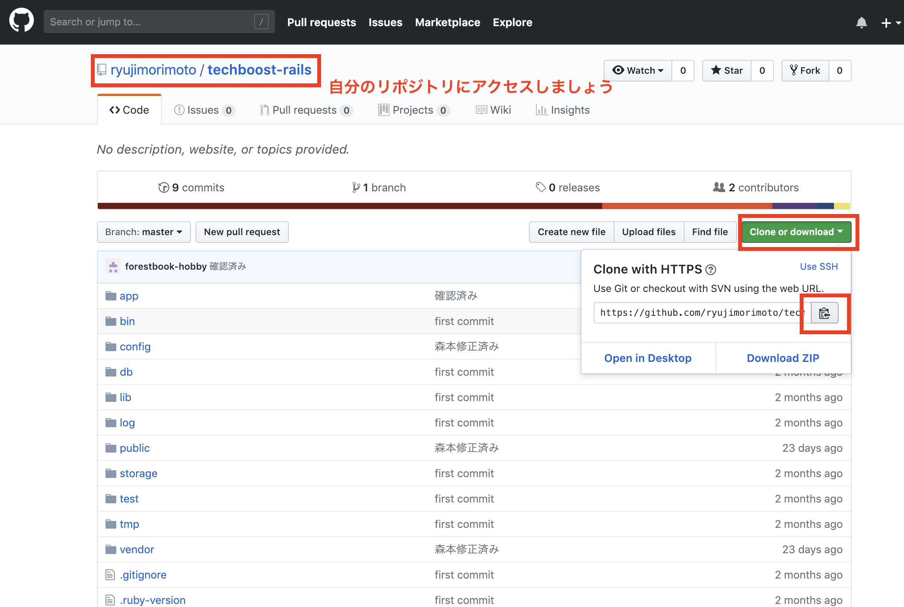
<hr>
<br />
<br />

```
$ git init
$ git pull https://github.com/[各自のリポジトリ].git
```


## DB変更する際の作業フロー
- gemファイルを追加　=>postgres からmySQLへ接続するgemの変更
- database.yml ファイルの変更 => railsが利用するDBの設定ファイル
- DBの作成　=> 新しいDBなのでまずアプリ用のDBを作成しないといけません。
- マイグレーションファイルの実行 => 作成したDBの中に、テーブルやカラムを追加していきます。

#### まずGemfileを見てみましょう

```
$ less Gemfile
```
lessというのはファイルの中身を表示します。
スクロールもします。
q ボタンを入力するまで閉じません。
便利です。


ではgemファイルの変更をしていきましょう。
```
$ vi Gemfile
```

いろんなgemが表示されています

```
# Use mysql as the database for Active Record
gem 'mysql2', '>= 0.4.4', '< 0.6.0', group: :development


group :production do
  gem 'pg', '>= 1.1.3'
end

```
ここですね。Herokuではgemにpg つまりpostgresへの接続を利用していました。</br>
:development環境では,mysql2 つまりMySQLを利用していました。
これを変更します。


```
group :production do
  gem 'mysql2', '>= 0.4.4', '< 0.6.0'
end
```

このように上記のgemをそのままコピーします。
ない方は、本家のサイトで確認ください。

https://rubygems.org/gems/mysql2


#### config>database.yml
を編集します。cdで移動して

```
default: &default
  adapter: mysql2
  encoding: utf8
  pool: <%= ENV.fetch("RAILS_MAX_THREADS") { 5 } %>
  username: <%= ENV.fetch("DBUSER_NAME") %>  //環境変数からDBの名前を取得します
  password: <%= ENV.fetch("DBUSER_PASSWORD") %>　　//環境変数からパスワードを取得します。
  socket: /var/lib/mysql/mysql.sock  //17章で探したソケットの場所を記入します。


  production:のセクションに、以下のように記述します。
  <<: *default
  database: pictgram_production

```
ここでusernameやpasswordに見慣れない書き方をしているのに気づいたと思います。  

#### username: <%= ENV.fetch("DBUSER_NAME") %>

これはサーバー上の環境変数から値を取得する場合のコーディングです。</br>  

どうして環境変数から取得するように変更したかと言うと、ソースにハードコーディングで直に書くのはセキュリティ上危険だからです。</br>  

ソースファイルがもし覗かれでもしたら、当然、DBのパスワードやunsernameも漏洩してしまいます。</br>  

このように記載しておくと、GitHub上に公開されても問題はありませんし、デプロイする環境の環境変数に登録をして、それを利用しますので、安全です。</br>


ではいまの環境設定を環境変数に書き込みましょう。  

#### 環境変数は通常 .bash_profile に書き込みます。

```
$ vi ~/.bash_profile

以下の3行を書き込みます。
export DBUSER_NAME=rails_user     //rails_userの値は各自で変わります。
export DBUSER_PASSWORD=password   //passwordも同様です。もっと複雑なパスワードをおすすめします。
export RAILS_ENV=production
```

#### 設定を反映します

```
$ source ~/.bash_profile

```

#### gemのインストール

```
$ bundle install

```

#### Railsのインストール
```
$ gem install -v [自分が作ったrailsのバージョン] rails
```

#### RailsでDBを作ります
先程のymlファイルに設定しているので,RailsからDB作成ができます。  
production環境であることを明示して作成します。(必須)


```
$ rails db:create RAILS_ENV=production

```

もしこのようなエラーが出た方はsecret_key_baseを作っていきましょう。</br>
これも、本番環境ならではの作業です。</br>
```
ArgumentError: Missing `secret_key_base` for 'production' environment, set this string with `rails credentials:edit`
```

#### secret_key_baseの作成

#### rails>configフォルダに移動して
新規ファイル**secrets.yml**ファイルを新規作成します
以下を貼り付けます。


```
production:
  secret_key_base: <%= ENV["SECRET_KEY_BASE"] %>
```

#### keyを生成
```
$ bundle exec rails secret

```
//出力されたものを~/.bash_profileを編集し、環境変数に設定します。
export SECRET_KEY_BASE=adeb90eaa8c5218c8f1512d02d82a1bc9e8813be4f396296fad976c331dbf2a209e5496f55017a900494bbdc359
#### 最後の:wqは書き込んでwrite 終了 quitの意味です。ESCキーを押すと左下に移動して入力できるようになります。


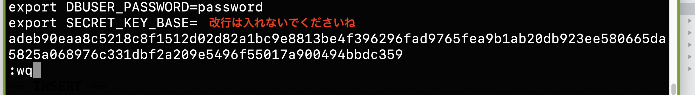

#### 設定を反映

```
$ source ~/.bash_profile
```

#### 再度railsでDB作成します。
```
$ rails db:create RAILS_ENV=production

//===
エラーがでなければ成功です。DBが作成されています
```

#### マイグレーションファイルを実行して,DBに詰め込んでいきます。

```
$ rails db:migrate RAILS_ENV=production
```

#### サーバー起動

```
rails s

//==このように表示されれば成功です。
=> Run `rails server -h` for more startup options
Puma starting in single mode...
* Version 3.12.0 (ruby 2.4.1-p111), codename: Llamas in Pajamas
* Min threads: 5, max threads: 5
* Environment: production
* Listening on tcp://0.0.0.0:3000
Use Ctrl-C to stop


```

#### 自分のIPアドレスとポートを指定してブラウザで見てみましょう。
IPアドレスは、EC2インスタンスを作成したとこで、確認できますね。

```
 IPアドレス:3000
```

で表示されます。
表示されない方は、1８章でポート3000番を開く方法を説明していますので、そちらを御覧ください。


## S3の利用
#### S3とは

画像などをDBに保存すると、検索などが遅くなります。  
それで通常は、画像、動画などを保存しておく、別のサーバーを構築します。後々の拡張も可能です。</br>

AWSではそれを簡単にしてくれるS3というサービスがあります。  

それを利用してみましょう。</br>

HerokuでS3を利用された方は、お馴染みの手順となりますが、もう一度ここでおさらいしておきましょう。</br>

### 作業フロー

- S3のサービスの利用　S3へのアクセス等は=>PHP/Laravelコース - Herokuへのデプロイ - tips：画像のアップロードも参考にしてください。(AWS SDK for PHPをインストールの直前までです。)

- fogのgemをインストール  
- carrywaveのイニシャライザを作成＝＞画像保存先を変更するため
- imageuploaderのストレージをファイルでなく、fogにする。

#### fogのgemのインストール
参考に本家サイトを上げておきます。

https://rubygems.org/gems/fog

https://rubygems.org/gems/fog-aws

Gemfileに以下を追加します.

```
gem 'fog'
gem 'fog-aws'

```

fogをインストールしましょう。

```
$ bundle install
```

fogを入れると、大量に黄色い文字でワーニングが出ることがあります。</br>
これは、fogの依存パッケージとなる一部のgemが廃止予定になっているためです。</br>
fogはクラウドサービスを利用するためのメインとなるgemであり、メンテナンスもされていますから、気にしないで大丈夫です。</br>
bundle installが成功したら、次の作業に進みましょう。</br>

## amazonS3サービスの利用

S3のバケットに接続するためのユーザをIAMで追加します。</br>
ここでは、S3にフルアクセスできる(CRUDの全権限を持つ) ポリシーを選択しています。</br>

ユーザー名は何でも良いです。
<br>
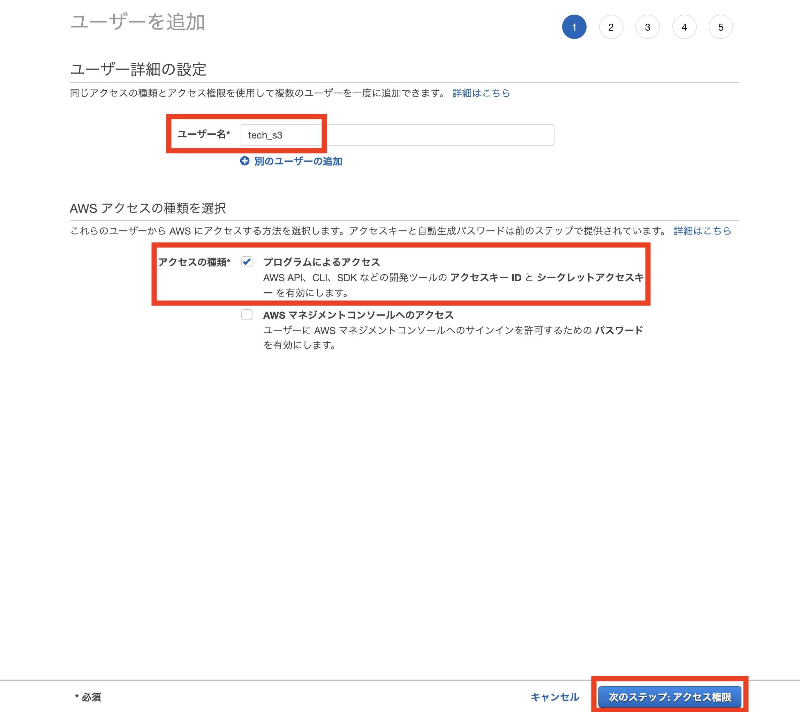
<br>

## ポリシーの選択
権限のようなものです。

<br>

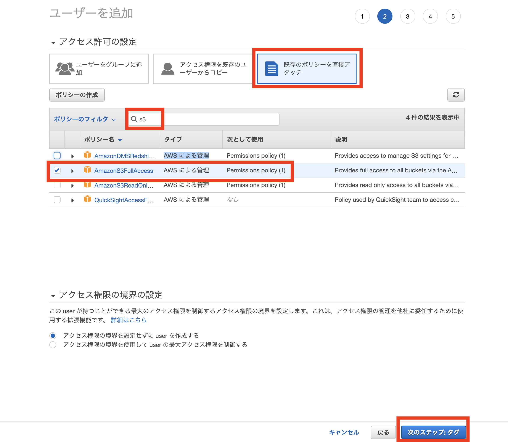

#### タグは後でわかりやすいように書き込んでおきます。必須ではありませんし、値はなんでも良いです
<br>

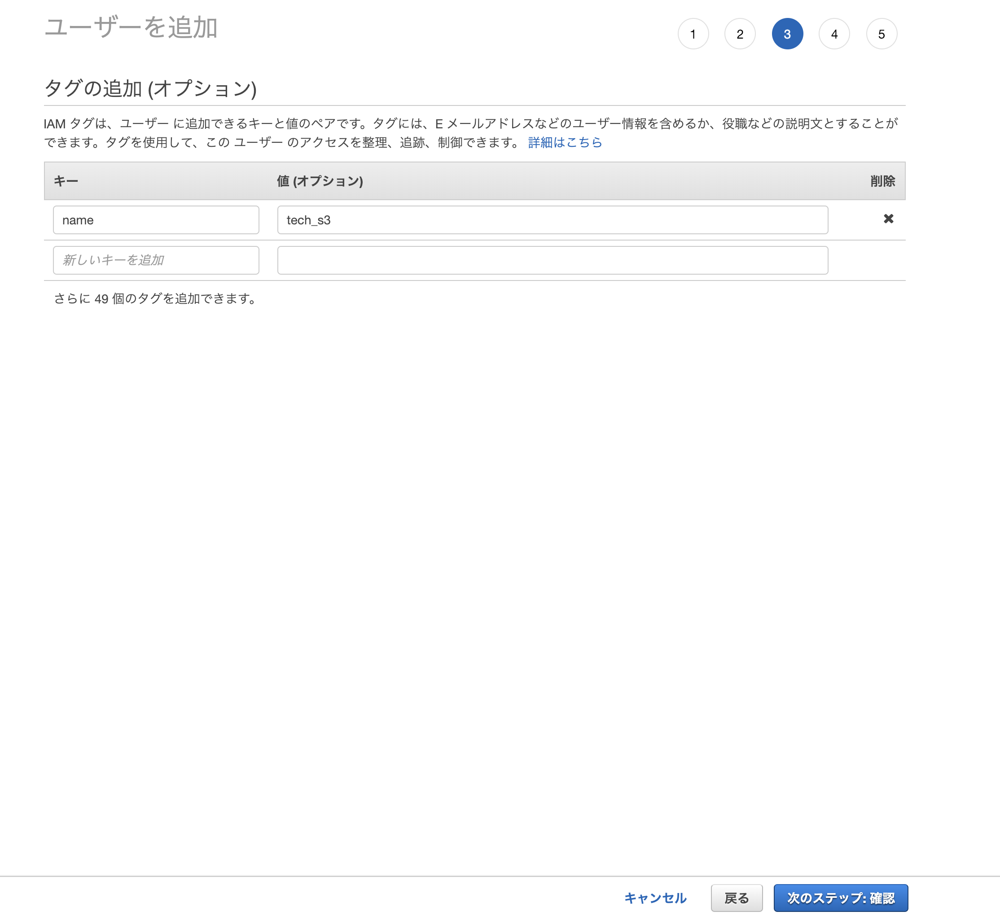

#### シークレットキーとアクセスキーはcarrywaveの設定に必要ですのできちんと分かるようにしておきましょう。
<br>

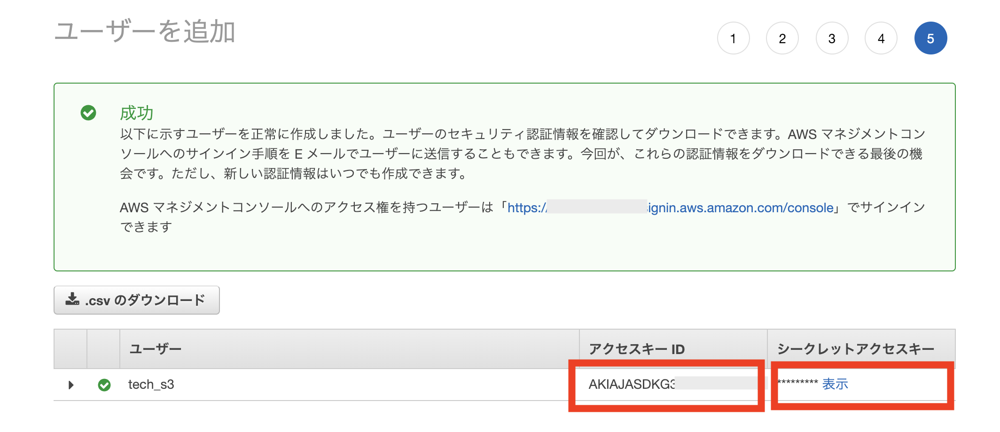


#### バケットを作って公開します。uploadsというフォルダを公開設定にします。


carrywaveを入れるとデフォルトでuploadsを見に行きます。

## S3にuploadsフォルダを作成します。

バケットを作成してください
(この画像では、すでにできています)
<br>

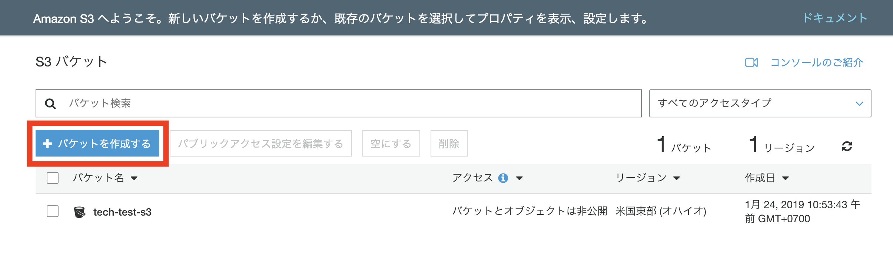

アクセス権限を設定します。  
画像データなど、見れないと意味がないので、公開にします。  

チェックを入れると横から、サイドバーが表示されます。  
アクセス権限をクリック  

<br>

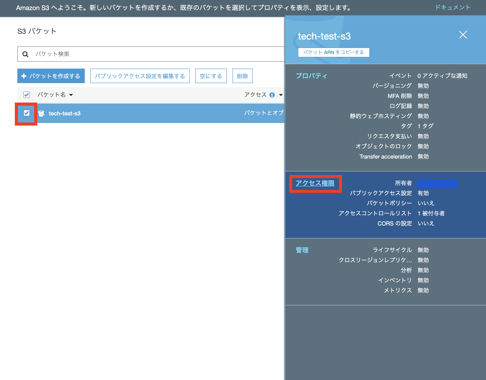

#### 編集をクリック  
#### すべてFalseにします

<br>

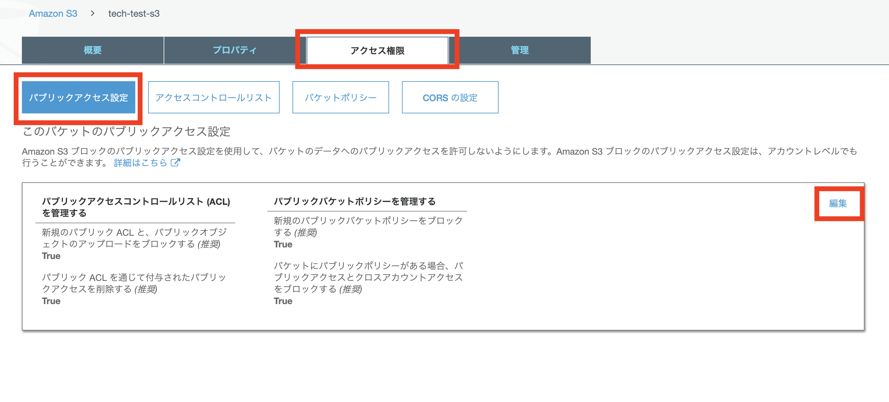

確認を入力し、ボタンを押します。
これは、サーバーlogなどをs3に保存することもあるので、公開していいですか？と確認しているわけです。  
今回は、公開する画像ファイルしかないので、問題ありません。


<br>

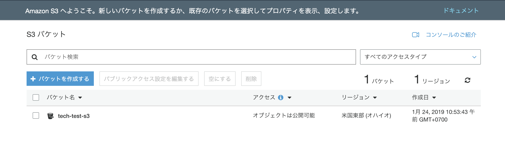

## uploadsフォルダを作成し公開する
<br>

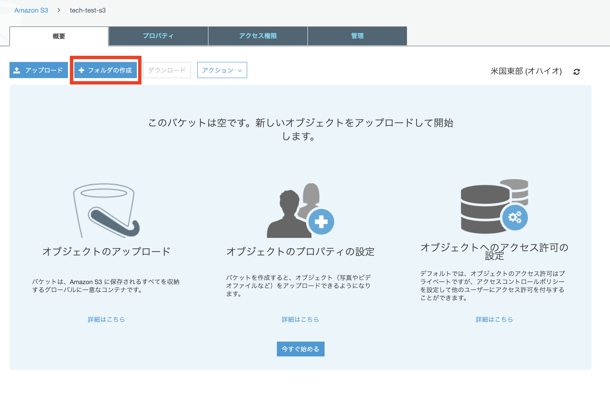

#### 画像は公開するので暗号化は付けません。
<br>

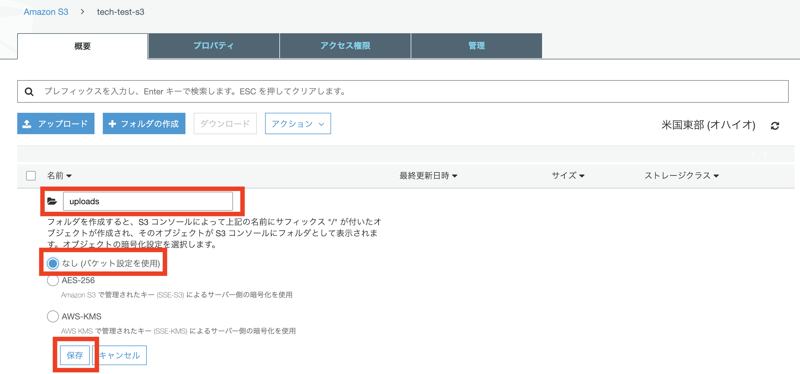


#### 公開しましょう
<br>

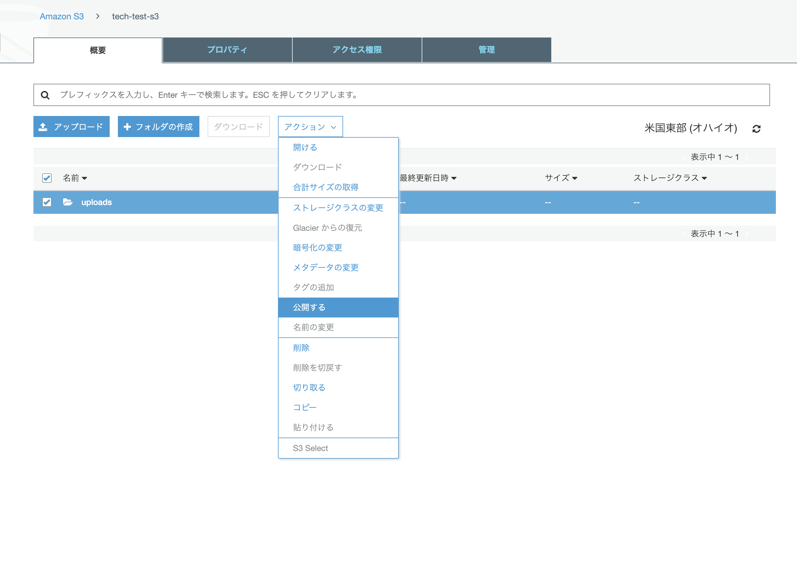

<br>


<br>
<br>

## carrywaveのイニシャライザを作成


#### app>uploaders>image_uploader.rb  を編集

この場所を
```
  # Choose what kind of storage to use for this uploader:
  storage :file
  # storage :fog
```

storageをfogに変更します。  
理由は、fogがs3 に接続してくれるからです。

このようになります

```
  #  storage :file
  storage :fog
```
参考にfogのドキュメントを貼っておきます。
https://github.com/fog/fog


#### config/initializers/carrierwave.rb を新規作成します。

```
CarrierWave.configure do |config|
 config.fog_credentials = {
   provider: 'AWS',
   //ここは先程のアクセスキーを指定します
   aws_access_key_id: ENV['AWS_S3_ACCESS_KEY'],,
   //先程のシークレットキーを指定
   ws_secret_access_key: ENV['AWS_S3_SECRET_KEY'],
   //リージョンは自分のサーバーのリージョンを設定します.
   region: 'ap-northeast-1',
   path_style: true
 }
 config.fog_public = true # public-read

 config.remove_previously_stored_files_after_update = false
 //バケット名をここに入力します。
 config.fog_directory = 'tech-test-s3'
 //ここがuploadsの前までのフルパスになります。
 if ImageUploader::storage == :fog
   config.asset_host = 'https://s3.us-east-2.amazonaws.com/tech-test-s3'
 end

end
# 文字化け対策
CarrierWave::SanitizedFile.sanitize_regexp = /[^[:word:]\.\-\+]/
```

データベースのユーザー名、パスワードと同じように、AWSのアクセスキーとシークレットアクセスキーは、環境変数から読み出すよう設定します。</br>
これらの情報は、くれぐれもソースファイルに直に書かないで下さいね。</br>
万一、情報が漏れたりすると、速攻でアマゾンから警告メールが飛んできます。</br>

.bash_profileを編集しましょう。

```
$ vi ~/.bash_profile

//==以下二行を追加

export AWS_S3_ACCESS_KEY=[AWSのアクセスキー]
export AWS_S3_SECRET_KEY=[AWSのシークレットアクセスキー]
```

設定を反映します。

```
$ source ~/.bash_profile
```

上記でがわからない項目がある場合、とりあえず写真をuploadして確認しましょう。</br>
urlからおよそのことがわかります。</br>


#### 画像アップロード先の切り替え

AWS S3へ画像をアップロードする方法は他にもあるのですが、この方法で実装を行うと、画像の保存先を、app\uploaders\image_uploader.rbで、手軽に切り替えることが出来ます。
```
　・
　・
# Choose what kind of storage to use for this uploader:
storage :file
#storage :fog
　・
　・
```
上記の状態では、保存先がローカルになります。</br>
strage :fileをコメントアウトし、storage :fogのコメントアウトを外せば、保存先がS3に変更になります。</br>
動作がおかしかったり、機能追加の改修などで、ローカルに保存先を戻したい場合も簡単に切り替えることが出来ます。


#### uploadsを選択
<br>

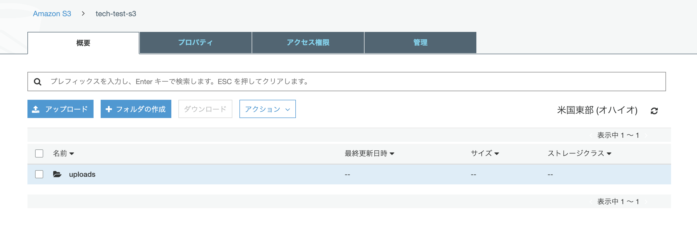

#### uploadを選択

<br>

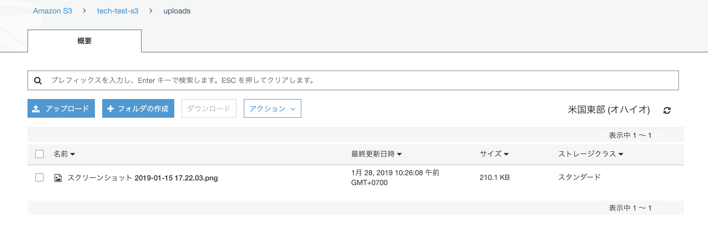

#### なんでもいいので画像をuploadします。

<br>

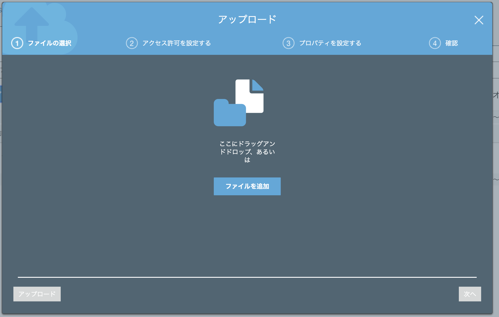

#### urlを確認してみましょう

ここで値を確認できます。
<br>


この場合
#### us-east-2　がリージョンになります。

#### tech-test-s3　がバケット名になります。

それでは、18章と同様に、pumaを起動して動作確認をしてみましょう。

```
$ rails s -b 0.0.0.0
```

画像を投稿して、S3に保存された画像が画面に表示されていることを確認して下さい。


### まとめ

これで、RailsアプリをAWS上でデプロイできました。</br>
herokuは、お手軽にデプロイできるサービスですので、ずいぶんと楽でした。</br>
AWSは手順が多く、難しいですが、その分、実際の業務アプリでも利用できるように、拡張性や、保守機能も優れています。</br>


この経験は、必ず、IT業界に入ったときにも役立つと思います。</br>
参考図書などを上げておきますので、プロになろうという意識を持っている方は、本を買って勉強してみてください。</br>

PHPのプロジェクトを公開する方は次章に、このままRubyのプロジェクトをnginxで公開する方は22章へ進んで下さい。</br>

#### 参考図書やサイト

VPCについての資料
https://d1.awsstatic.com/webinars/jp/pdf/services/20180418_AWS-BlackBelt_VPC.pdf

AWSを勉強するにはとても良い本です。初学者でもわかりやすく説明されています。
https://www.amazon.co.jp/Amazon-Web-Services-%E5%9F%BA%E7%A4%8E%E3%81%8B%E3%82%89%E3%81%AE%E3%83%8D%E3%83%83%E3%83%88%E3%83%AF%E3%83%BC%E3%82%AF-%E3%82%B5%E3%83%BC%E3%83%90%E3%83%BC%E6%A7%8B%E7%AF%89/dp/4822237443/ref=sr_1_4?ie=UTF8&qid=1548688846&sr=8-4&keywords=aws
