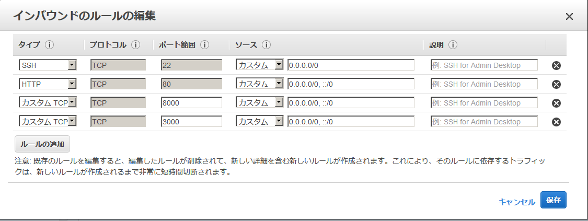
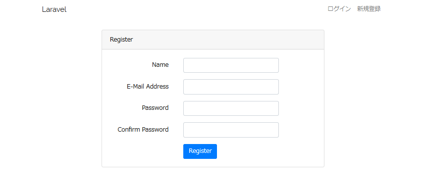

# (21)PHPアプリのデプロイ

## S3の準備

まずは、19章を読んで、AWSのS3を利用できるよう、準備して下さい。
S3の準備が終わったら、次の作業に移って下さいね。

#### Laravelの環境ファイルを作ります。
プロジェクトの直下に作ります。
名前は .env


下記を貼り付けます。

```
APP_NAME=Laravel
APP_ENV=local
APP_KEY=base64:PAOxi8AN6ISrrDhmQaZEB9hEJgka7T2oRxNSXJkFeLQ=
APP_DEBUG=true
APP_URL=http://localhost

LOG_CHANNEL=stack

DB_CONNECTION=mysql
DB_HOST=127.0.0.1
DB_PORT=3306
DB_DATABASE=mynews4ec2
DB_USERNAME=root
DB_PASSWORD=

BROADCAST_DRIVER=log
CACHE_DRIVER=file
QUEUE_CONNECTION=sync
SESSION_DRIVER=file
SESSION_LIFETIME=120

REDIS_HOST=127.0.0.1
REDIS_PASSWORD=null

REDIS_PORT=6379

MAIL_DRIVER=smtp
MAIL_HOST=smtp.mailtrap.io
MAIL_PORT=2525
MAIL_USERNAME=null
MAIL_PASSWORD=null
MAIL_ENCRYPTION=null

PUSHER_APP_ID=
PUSHER_APP_KEY=
PUSHER_APP_SECRET=
PUSHER_APP_CLUSTER=mt1

MIX_PUSHER_APP_KEY="${PUSHER_APP_KEY}"
MIX_PUSHER_APP_CLUSTER="${PUSHER_APP_CLUSTER}"


# 松田追加

# Storage種別 (local or s3)
FILESYSTEM_DRIVER_TYPE_LOCAL=local
FILESYSTEM_DRIVER_TYPE_S3=s3

# 以下を切り替えてローカルとAWS S3に画像保存先を変更
#FILESYSTEM_DRIVER="${FILESYSTEM_DRIVER_TYPE_LOCAL}"
FILESYSTEM_DRIVER="${FILESYSTEM_DRIVER_TYPE_S3}"

NO_NEWS_IMAGE_FILENAME=no-image4news.png
NO_PROFILE_IMAGE_FILENAME=no-image4profile.png
IMAGE_URL_PREFIX=public/image

#S3の設定

# 各自のACCESS_KEYを入力します
AWS_S3_ACCESS_KEY=各自のACCESS_KEY

# 各自のSECRET_KEYを入力します
AWS_S3_SECRET_KEY=各自のSECRET_KEY
AWS_S3_REGION=ap-northeast-1

# 各自のS3バケット名を入力します
AWS_S3_BUCKET=

# このurlの.com以下にバケット名を追加します。
AWS_S3_URL=https://s3-ap-northeast-1.amazonaws.com/各自のバケット名
```


#### composerのupdateするときにamazon のS3を使えるようにする。

composer.jsonのrequireに
#### "league/flysystem-aws-s3-v3" : "~1.0"
を追加します。


```
$ vi composer.json

//==一部省略
   "require": {
        "php": "^7.1.3",
        "doctrine/dbal": "^2.9",
        "fideloper/proxy": "^4.0",
        "laravel/framework": "5.7.*",
        "laravel/tinker": "^1.0",
     //==ここです
        "league/flysystem-aws-s3-v3" : "~1.0"
    },
```

### S3の定義をする。

#### config>filesystems.php

#### disksにs3の項目を追加します。

```
 'disks' => [
        //== 変更ここから
        's3' => [
            'driver' => 's3',
            'key' => env('AWS_S3_ACCESS_KEY'),
            'secret' => env('AWS_S3_SECRET_KEY'),
            'region' => env('AWS_S3_REGION'),
            'bucket' => env('AWS_S3_BUCKET'),
            'url' => env('AWS_S3_URL'),
        //==変更ここまで
        ],

```

#### composerをupdateします


```
$ composer update --no-scripts
```

すると、こんなエラーが出ました。</br>
どうやらメモリが足りないと言っていますね。

```
The following exception is caused by a lack of memory or swap, or not having swap configured
Check https://getcomposer.org/doc/articles/troubleshooting.md#proc-open-fork-failed-errors for details

```


#### メモリ管理のswapファイルを変更します。

swapファイルとは、メモリが不足した場合に、メモリの内容を一旦ファイルに待避して、足りないメモリを補うためのものです。</br>
良い機会ですので、使い方を覚えておいて下さいね。</br>

```
$ sudo dd if=/dev/zero of=/swap bs=1M count=1024

$ sudo mkswap /swap

$ sudo swapon /swap

$ sudo chmod 600 /swap

//==チェックします。

$ free

//==良さそうですね
             total       used       free     shared    buffers     cached
Mem:       1009432     946648      62784         60       2056     681556
-/+ buffers/cache:     263036     746396
Swap:      1048572          0    1048572
```

#### 再度composerをupdateに挑戦
```
$ composer update --no-scripts


//==
Discovered Package: laravel/tinker
Discovered Package: nesbot/carbon
Discovered Package: nunomaduro/collision
Package manifest generated successfully.
```
うまくいきました。めでたし、めでたし。


## S3を利用できるように機能を実装します。
#### これからの作業を説明します。

S3利用のためのコーディングは、色々なやり方があります。</br>
この教材では、汎用に使える実装＋簡単に画像の保存先をローカルとS3で切り替えられるように、という意図での実装例を挙げています。</br>

まず、Utlというファサードを追加します。
コントローラーでもViewでもよく使う関数を、ファサードのクラスに実装しておくことで、Utl::関数名()のように、手軽に呼び出せるようにし、且つ仕様の変更などがあった場合に、改修を楽にするのが目的です。

ファサードという用語が耳慣れない方は、こちらを参考にして下さい。
https://qiita.com/yousan/items/18dab4dbac4a27ce3662

例えば、ログインしているかをチェックする場合、教科書通りですと、LaravelのAuthという認証用のクラスメソッドを利用して、Auth::check()と書きます。

しかし、一般ユーザーと管理者を分ける等の仕様変更を行ったりして、認証方式が変わると、各コントローラーやViewの各所でAuth::check()とそのまま書いてあった場合には、それら全てを改修しなければならなくなります。

そこで、認証のチェック関数をファサードのユーティティクラスに実装しておき、コントローラーやViewには、Utl::isLogin() というように書いておくわけです。</br>
こうしておけば、認証方式が変更になっても、UtlクラスのisLogin関数だけを改修すれば作業が完了します。

Utlというのは、utility(便利ツールのような意味)の略です。煩雑なコードになりがちなViewでも、短く記述できるよう、三文字でクラス名を定義しています。</br>

このUtlクラスに、環境設定の.envの設定値をチェックして保存先をlocalとS3を切り替えて、画像の保存、削除を行う下位関数を実装します。</br>

次に、コントローラーの基底クラスに、Utlの下位関数を利用して、画像の保存、削除、入れ替えを行うprotectedスコープの関数を実装します。</br>

NewsやProfilesのコントローラーでは、基底クラスの画像関連関数を呼び出して実際の処理を行います。</br>

それでは、実際に実装していきましょう。


#### app/Providers/UtlServiceProvider.php　を作成します。
フォルダに移動して UtlServiceProvider.php を作成してください

ソースはこちらになります
```
<?php

namespace App\Providers;

use Illuminate\Support\ServiceProvider;

class UtlServiceProvider extends ServiceProvider
{
 /**
  * Bootstrap services.
  *
  * @return void
  */
 public function boot()
 {
     //
 }

 /**
  * Register services.
  *
  * @return void
  */
 public function register()
 {
   $this->app->singleton('utl', function() {
     return new \App\Http\Components\Utl;
   });
 }
}
```
#### Utlファサード処理実装クラスの作成


app/Http/Componentsディレクトリを新設し、</br>
app/Http/Components/Utl.phpを新規作成します</br>

#### Utl.php

```
<?php
namespace App\Http\Components;

use Auth;

/**
* Utlファサードの処理実装クラス
*/
class Utl
{
  /**
  * null か 空文字であるかの真偽値を返す
  *
  * @param  オブジェクト
  * @return null か 空文字である場合はtrue、それ以外の場合はfalse
  */
  public function isNullOrEmpty($object) {
    return is_null($object) || ('' == $object);
  }

  /**
  * 文字列が等価であるかの真偽値を返す
  *
  * @param  比較対象String１
  * @param  比較対象String２
  * @return 文字列が等価ならtrue、それ以外の場合はfalse
  */
  public function isSameStr($str1, $str2) {
    return !is_null($str1) && !is_null($str2) && (0 == strcmp($str1, $str2));
  }

  /**
  * ログインしているかの真偽値を返す
  *
  * @param  void
  * @return ログインしているかの真偽値
  */
  public function isLogin() {
    return Auth::check();
  }

  /**
  * 管理者でログインしているかの真偽値を返す
　* 暫定でUser.idにて管理者を判別しているが、将来的にはDBテーブルから分けて実装すべき
  *
  * @param  void
  * @return 管理者でログインしているかの真偽値
  */
  public function isAdmin() {
    return self::isLogin() && 1 === Auth::id();
  }

  /**
  * ニュース画像無しの場合のファイル名を取得
  *
  * @param  void
  * @return ニュース画像無しの場合のファイル名
  */
  public function getNoNewsImgFileName() {
    return env('NO_NEWS_IMAGE_FILENAME');
  }

  /**
  * プロフィール画像無しの場合のファイル名を取得
  *
  * @param  void
  * @return プロフィール画像無しの場合のファイル名
  */
  public function getNoProfileImgFileName() {
    return env('NO_PROFILE_IMAGE_FILENAME');
  }

  /**
  * StorageTypeがs3であるかの真偽値を返す
  *
  * @param  void
  * @return StorageTypeがs3であるかの真偽値
  */
  public function isS3() {
    return self::isSameStr(env('FILESYSTEM_DRIVER'), env('FILESYSTEM_DRIVER_TYPE_S3'));
  }

  /**
  * ニュース画像へのフルパス取得
  *
  * @param  画像ファイル名
  * @return 画像ファイルへのフルパス
  *         画像ファイル名が空の場合は、画像無しのファイルパスを返す
  */
  public function getNewsImagePath($filename) {

    if (self::isS3()) {
      $ret = env('AWS_S3_URL') . '/' . env('IMAGE_URL_PREFIX') . '/' . (self::isNullOrEmpty($filename) ? self::getNoNewsImgFileName() : $filename);
    } else {
      $ret = asset('storage/image/' . $filename);
    }
    return $ret;
  }

  /**
  * プロフィール画像へのフルパス取得
  *
  * @param  画像ファイル名
  * @return 画像ファイルへのフルパス
  *         画像ファイル名が空の場合は、画像無しのファイルパスを返す
  */
  public function getProfileImagePath($filename) {

    if (self::isS3()) {
      $ret = env('AWS_S3_URL') . '/' . env('IMAGE_URL_PREFIX') . '/' . (self::isNullOrEmpty($filename) ? self::getNoProfileImgFileName() : $filename);
    } else {
      $ret = asset('storage/image/' . $filename);
    }
    return $ret;
  }

  /**
  * JavaScriptによる確認画面付きの<a />タグを生成する
  * putComfirmJsとペアで使うことで、画面に確認画面付きのリンクを実装する
  *
  * @param $cssClass:スタイルシートのクラス名
  * @param $funcName:JavaScript関数名
  * @param $url:OKボタンで遷移するurl
  * @param <a />タグの表示ラベル
  * @return void
  */
  public function confirmATag($cssClass, $funcName, $url, $lavel) {
      $aTag = "<a ";
      if (!self::isNullOrEmpty($cssClass)) {
        $aTag .= "class=\"" . $cssClass . "\" ";
      }
      $aTag .= "href=\"javascript:void(0);\"" . " onclick=\"" . $funcName . "('" . $url . "'); return false;\">" . $lavel . "</a>\n";
      echo $aTag;
  }

  /**
  * 確認画面を表示するJavaScriptを画面に出力する
  * confirmATagとペアで使うことで、画面に確認画面付きのリンクを実装する
  *
  * @param  $funcName:JavaScript関数名
  * @param  $msg:確認メッセージ
  * @return void
  */
  public function putConfirmJs($funcName, $msg) {
    $script =
      'function ' . $funcName . "(\$url) {\n" .
    "    if(window.confirm('" . $msg . "')) {\n" .
    "      location.href = \$url;\n" .
    "    }\n" .
    "  }\n";
    echo $script;
  }
}
```


#### app/Facads/Utl.php を作成します

#### Utl.php

```
<?php
/**
* Utlのファサードクラス
*/
namespace App\Facades;

use Illuminate\Support\Facades\Facade;

/**
* Bladeのビューで利用できるユーティリティ関数を保持するクラス
*/
class Utl extends Facade {
  protected static function getFacadeAccessor() {
    return 'utl';
  }
}
```

#### 追加したファサードのクラスをconfig/app.phpに登録します。

```
'providers' => [
　　・
　　・
　　・

       /*
        * Application Service Providers...
        */
       App\Providers\AppServiceProvider::class,
       App\Providers\AuthServiceProvider::class,
       // App\Providers\BroadcastServiceProvider::class,
       App\Providers\EventServiceProvider::class,
       App\Providers\RouteServiceProvider::class,

       //==ここの一行を追加
       App\Providers\UtlServiceProvider::class,
       //==ここまで
   ],

```

### app\Http\Controllers\Controller.php(各コントローラーの基底クラス)に、Utlクラスの関数を利用して、画像の保存、削除、置換の関数を実装します。

#### Controller.php

```
<?php

namespace App\Http\Controllers;

use Illuminate\Foundation\Bus\DispatchesJobs;
use Illuminate\Routing\Controller as BaseController;
use Illuminate\Foundation\Validation\ValidatesRequests;
use Illuminate\Foundation\Auth\Access\AuthorizesRequests;
use Illuminate\Support\Facades\Storage;
use Utl;

class Controller extends BaseController
{
  use AuthorizesRequests, DispatchesJobs, ValidatesRequests;

  // 追加ここから
  /**
  * 画像ファイル名が「画像無し」又は空かの真偽値を返す
  *
  * @param  画像ファイル名
  * @return 画像ファイル名が「画像無し」又は空かの真偽値
  */
  protected function isNoImage($filename) {

    return Utl::isNullOrEmpty($filename) || Utl::isSameStr(Utl::getNoNewsImgFileName(), $filename) || Utl::isSameStr(Utl::getNoProfileImgFileName(), $filename);
  }

  /**
  * 画像ファイルをストレージにアップロードする
  *
  * @param  リクエストから取り出した画像オブジェクト
  * @return 一意となる画像ファイル名
  */
  protected function storeImage($imageObj) {

    $imageName = '';
    if (!Utl::isNullOrEmpty($imageObj)) {
      $imageName = Storage::disk(env('FILESYSTEM_DRIVER'))->putFile(env('IMAGE_URL_PREFIX'), $imageObj, 'public');
    }
    return $imageName;
  }

  /**
  * ストレージの画像ファイルを削除する
  *
  * @param  削除する画像のファイル名
  * @return void
  */
  protected function deleteImage($filename) {

    if (!Utl::isNullOrEmpty($filename) && !self::isNoImage($filename)) {
      $filePath = env('IMAGE_URL_PREFIX') . '/' . $filename;
      Storage::disk(env('FILESYSTEM_DRIVER'))->delete($filePath);
    }
  }

  /**
  * ストレージの画像ファイルを入れ替える
  *
  * @param  リクエストから取り出した画像オブジェクト
  * @param  削除する画像のファイル名
  * @return 入れ替えた画像の一意となるファイル名
  */
  protected function swapImage($imageObj, $filename) {

    // 画像を保存
    $imageName = self::storeImage($imageObj);

    // 保存に成功した場合、入れ替え対象の画像を削除する
    if (!Utl::isNullOrEmpty($imageName) && !self::isNoImage($filename)) {
      self::deleteImage($filename);
    }
    return $imageName;
  }
}

```
基底クラスに画像の処理関数を実装しておけば、Controllerクラスを継承しているNewsControllerやProfileControllerで、親クラスの画像処理関数を利用できます。</br>
機能拡張で、他の画像を扱う場合でも、同様のコーディングで、比較的簡単に処理を追加実装できます。</br>

#### NewsControllerでの実装例：
各自このソースを読んで、自分なりに変更してください。

```
<?php

namespace App\Http\Controllers\Users;

use App\History;
use App\Http\Controllers\Controller;
use App\News;
use Carbon\Carbon;
use Illuminate\Http\Request;
use Illuminate\Support\Facades\Auth;
use Utl; // 追加してます

class NewsController extends Controller
{
    public function add()
    {
        return view('users.news.create');
    }

    public function create(Request $request)
    {
        // Varidationを行う
        $this->validate($request, News::$rules);

        $news = new News;
        $news->user_id = $request->user()->id;

        $form = $request->all();

        // フォームから画像が送信されてきたら、保存して、$news->image_path に画像のパスを保存する
        if (isset($form['image'])) {

            // 変更ここから
            //$path = $request->file('image')->store('public/image');
            $path =  parent::storeImage($request->file('image'));
            // 変更ここまで

            $news->image_path = basename($path);
        } else {
            $news->image_path = null;
        }

        // フォームから送信されてきた_tokenを削除する
        unset($form['_token']);
        unset($form['image']);
        // データベースに保存する
        $news->fill($form);
        $news->save();

        return redirect('news/' . $news->id . '/show');
    }

    public function index(Request $request)
    {
        $cond_title = $request->cond_title;
        if ($cond_title != '') {
            // 検索されたら検索結果を取得する
            $posts = News::where('title', 'LIKE', "%{$cond_title}%")->get();

        // 変更ここから
        //} else if (Auth::user()->id === 9) {
        } else if (Utl::isAdmin()) {
        // 変更ここまで

            $posts = News::where('user_id', $request->id)->get();
            return view('users.news.index', ['posts' => $posts, 'cond_title' => $cond_title]);
        } else {
            $posts = News::all()->sortByDesc('created_at');
        }
        return view('users.news.index', ['posts' => $posts, 'cond_title' => $cond_title]);
    }

    public function edit(Request $request)
    {
        // News Modelからデータを取得する
        $news = News::find($request->id);

        // 変更ここから
        // if (Auth::user()->id === 9) {
        if (Utl::isAdmin()) {
        // 変更ここまで

            return view('users.news.edit', ['news_form' => $news]);
        } else if (!$news || Auth::user()->id != $news->user_id) {
            return redirect('users/news/');
        }
        return view('users.news.edit', ['news_form' => $news]);
    }

    public function update(Request $request)
    {
        $this->validate($request, News::$rules);
        $news = News::find($request->id);
        $news_form = $request->all();

        if ($request->remove == 'true') {

            //追加ここから
            if (!Utl::isNullOrEmpty($news->image_path)) {
              parent::deleteImage($news->image_path);
            }
            //追加ここまで

            $news_form['image_path'] = null;
        } elseif ($request->file('image')) {

            // 変更ここから
            //$path = $request->file('image')->store('public/image');
            $path =  parent::swapImage($request->file('image'), $news->image_path);
            // 変更ここまで

            $news_form['image_path'] = basename($path);
        } else {
            $news_form['image_path'] = $news->image_path;
        }

        unset($news_form['_token']);
        unset($news_form['image']);
        unset($news_form['remove']);
        $news->fill($news_form)->save();

        $history = new History;
        $history->news_id = $news->id;
        $history->edited_at = Carbon::now();
        $history->save();

        return redirect('news/' . $news->id . '/show');

    }

    public function delete(Request $request)
    {
        // 該当するNews Modelを取得
        $news = News::find($request->id);

        // 追加ここから
        // 画像が登録されていれば削除する
        if (!Utl::isNullOrEmpty($news->image_path)) {
          parent::deleteImage($news->image_path);
        }
        // 追加ここまで

        // 削除する
        $news->delete();
        return redirect('users/news/');
    }

}
```

#### localとS3の切り替え
画像保存先の切り替えは、プロジェクト直下の.envファイルで行います。</br>
以下の一行のコメントを付け替えるだけです。

```
# 以下を切り替えてローカルとAWS S3に画像保存先を変更
#FILESYSTEM_DRIVER="${FILESYSTEM_DRIVER_TYPE_LOCAL}"
FILESYSTEM_DRIVER="${FILESYSTEM_DRIVER_TYPE_S3}"
```

上記の設定では、保存先がS3になります。
ローカルに保存するには、以下のようにコメントを付け替えます。

```
FILESYSTEM_DRIVER="${FILESYSTEM_DRIVER_TYPE_LOCAL}"
#FILESYSTEM_DRIVER="${FILESYSTEM_DRIVER_TYPE_S3}"
```


### Laravel-mixのインストール

次に、アセットのコンパイルを行うため、Laravel-mixをインストールしましょう。</br>
自分のプロジェクトフォルダに移動します。</br>
その直下にwebpack関係をインストールしていきます。

```
$ npm install laravel-mix cross-env node-sass --save-dev
```

#### SASSファイル、js等アセットをコンパイルします。

```
$ npm run watch
```
npmについての資料。
https://qiita.com/hashrock/items/15f4a4961183cfbb2658


## DBを作成します
#### MySQLにログインして作成します。

```
$ mysql -u root


//==DBを作成します。名前は各自自由に決めて、.envとの整合を取ってください。
mysql> create database mynews4ec2;

//==
Query OK, 1 row affected (0.01 sec)

//==userを作成します。user名とpasswordは、 各自自由に決めて、.envとの整合を取ってください。
create user 'techboost'@'localhost' identified by 'password';

//== techboost ユーザーに　先程つくったDBへの権限を与えます パスワードも各自のに変更してください
mysql> grant all on mynews4ec2.* to 'techboost'@'localhost' identified by 'password';

//==設定を反映します。
mysql> flush privileges;

//==
Query OK, 0 rows affected (0.02 sec)

```


#### 設定の確認をします

```
//==まずユーザー

mysql> select User,Host from mysql.user;

//techboostユーザーがあります。
+---------------+-----------+
| User          | Host      |
+---------------+-----------+
| mysql.session | localhost |
| mysql.sys     | localhost |
| root          | localhost |
| techboost     | localhost |
+---------------+-----------+
4 rows in set (0.00 sec)


//DBがあることも確認しましょう

mysql> show databases;

//== DBの　mynews4ec2　があります
+--------------------+
| Database           |
+--------------------+
| information_schema |
| mynews4ec2         |
| mysql              |
| performance_schema |
| sys                |
+--------------------+
5 rows in set (0.00 sec)

//==mysqlを抜けます。

mysql> exit;
Bye

```
#### Laravel でDBのテーブルを作成します。

先程のDB名とDBUSER名、パスワードをもう一度 .env ファイルで確認してから実行しましょう。</br>

```
$ php artisan migrate

//==こんな感じになります。
Migration table created successfully.
Migrating: 2014_10_12_000000_create_users_table
Migrated:  2014_10_12_000000_create_users_table
Migrating: 2014_10_12_100000_create_password_resets_table
Migrated:  2014_10_12_100000_create_password_resets_table
```

#### phpのビルトインサーバーで動作確認

それでは、動作確認をしてみましょう。</br>
１８章で行ったインバウンドの設定で、ポートの8000番を同様の手順で解放してから、以下のコマンドを打って下さい。</br>
nginxでアプリを公開するときのために、http(ポート80)の解放も、ここでついでにやっておきましょう。</br>



```
$ php -S 0.0.0.0:8000 -t public server.php

PHP 7.2.16 Development Server started at Tue May  7 08:21:40 2019
Listening on http://0.0.0.0:8000
Document root is /home/centos/webroot/php_projects/mynews/public
Press Ctrl-C to quit.
```

ブラウザのアドレスバーに、EC2インスタンスのグローバルアドレス:8000/registerと打ってユーザー登録画面を表示してみましょう。</br>



うまく行きましたね！</br>
次章では、いよいよnginxによるプロジェクトの公開を行います。
