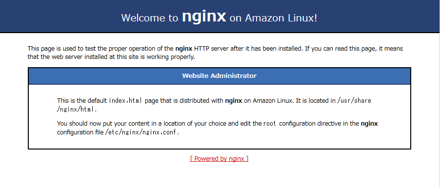
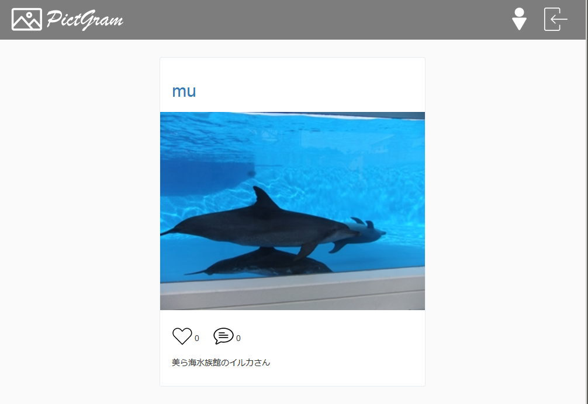

# (22)nginxの導入とアプリの公開

- Nginx(エンジンエックス）とはHTTPリクエストを送った時に、何かしらのレスポンスを返すプログラムです。</br>
下記記事を読んでおいてください。WEBサーバーのミドルウエアで、Apache（アパッチ）と並ぶ2代勢力です。</br>
https://qiita.com/kamihork/items/49e2a363da7d840a4149

nginxドキュメント和訳</br>
http://mogile.web.fc2.com/nginx/

今回は、独自ドメインの取得は行わずに、RubyとPHPのプロジェクトを、nginxの有効バーチャルホストを切り替えて公開できるように設定します。</br></br>

それでは、nginxをインストールします。
nginxは、stableとmainline２つのリポジトリがありますが、mainlineの利用が推奨されています。

## リポジトリ追加
https://nginx.org/en/linux_packages.html#RHEL-CentOS</br>
上記の記事通り、以下のようにしてリポジトリを追加します。

```
$ sudo vi /etc/yum.repos.d/nginx.repo
```

viで開いたリポジトリのファイルに、以下の内容を貼り付けます。

```
[nginx-stable]
name=nginx stable repo
baseurl=http://nginx.org/packages/centos/$releasever/$basearch/
gpgcheck=1
enabled=1
gpgkey=https://nginx.org/keys/nginx_signing.key

[nginx-mainline]
name=nginx mainline repo
baseurl=http://nginx.org/packages/mainline/centos/$releasever/$basearch/
gpgcheck=1
enabled=0
gpgkey=https://nginx.org/keys/nginx_signing.key
```

stableリポジトリを無効にし、mainlineのリポジトリを有効にします。
```
$ sudo yum-config-manager --disable nginx-stable
$ sudo yum-config-manager --enable nginx-mainline
```

nginxをインストールします。
```
$ sudo yum install nginx
```

## nginxの起動と動作確認
nginxを起動します。
```
$ sudo systemctl start nginx
```
EC2インスタンスのIPアドレスを、ブラウザのアドレスバーに入力してみましょう。
下図のような画面が出ていればインストールは成功です。



起動が確認できましたので、nginxを一旦停止しておきましょう。

```
$ sudo systemctl stop nginx
```


## nginxの利用準備

### ユーザー、ユーザーグループの作成と設定

nginxの実行ユーザは、デフォルトではnginxになっています。</br>
これは周知の事実なので、セキュリティ上、実行ユーザーを変更しておきたいところです。</br></br>

また、nginxのデフォルトの公開ディレクトリは、/usr/share/nginx/html等です(OSやnginxのバージョンによって異なります)。</br>
ここにプロジェクトを展開して公開するのであれば問題はないのですが、
/home/centos配下等のディレクトリを公開する場合には、nginxの実行ユーザの権限とディレクトリのオーナー権限が合っていないと、パーミッションエラーに遭遇することがあります。</br></br>

かといって、/home/centosのオーナーをnginxに変更するわけにもいきません。</br>
ログインユーザーであるcentosで、プロジェクトにファイルを追加したり、ファイルを変更することもできなくなってしまうからです。</br>

そこで、nginx用の実行ユーザーを新たに作成し、そのユーザーとcentosのユーザーグループを同じにする、という準備を行います。</br>
ここでは、nginxの実行ユーザーをwebmanに変更し、同名のユーザーグループを作成して、centosを、ユーザーグループwebmanに参加させるという準備を行います。</br>
その後、公開するプロジェクトのディレクトリのオーナーグループを、webmanに変更します。</br>
こうすることで、nginxがプロジェクト配下のファイルを読み取り実行できるようにし、なおかつオーナーであるcentosがファイルの追加、変更を行えるようにするわけです。</br></br>

なお、今回はnginxの実行ユーザー名をwebmanとしましたが、ユーザー名は任意ですので、各自考えて作成して下さってかまいません。</br>

```
$ sudo useradd -s /sbin/nologin -M webman
$ sudo gpasswd -a centos webman
```

作成したユーザーとユーザーグループを確認しましょう。

```
$ cat /etc/passwd | grep webman

webman:x:1001:1001::/home/webman:/sbin/nologin
```

```
$ id webman

uid=1001(webman) gid=1001(webman) groups=1001(webman)
```


centosが、ユーザーグループwebmanに追加されたことを確認しましょう。

```
$ id centos

uid=1000(centos) gid=1000(centos) groups=1000(centos),10(wheel),1001(webman)
```

### ホームディレクトリのパーミッションとオーナー変更

まず、/home/centosから、公開するプロジェクトのあるディレクトリのパーミッションを775に再帰的に変更しましょう。</br>
nginxやphp-fpmが、プロジェクトのアセットなどに問題無くアクセスできるように、また、ファイルのアップロードやログ出力するための下準備です。</br>
これをやっておかないと、アプリは動作するのにCSSだけが当たらない、というような障害が発生することがあります。</br>
```
$ sudo su -
# cd /home
# chmod 775 centos
# chmod 775 -R /home/centos/webroot

```

次に、centosのホームディレクトリと、公開ディレクトリのオーナーグループを、webmanに変更します。</br>
-Rオプションを付けることで、再帰的にサブディレクトリ内のオーナーグループも変更されます。</br>
/homeに移動して作業して下さい。</br>

```
# chown centos:webman centos
# chown -R centos:webman centos/webroot
# exit
```

ユーザーグループが変更されたことを確認してみましょう。

```
ls -la

total 36
drwxrwxr-x 10 centos webman  226 May  7 08:21 .
drwxr-xr-x  5 root   root     54 May  7 11:25 ..
-rw-------  1 centos centos 4303 Mar 27 14:08 .bash_history
-rw-r--r--  1 centos centos   18 Jul 27  2018 .bash_logout
-rw-r--r--  1 centos centos  420 May  7 07:04 .bash_profile
-rw-r--r--  1 centos centos  232 May  7 07:04 .bashrc
drwxrwxr-x  3 centos centos   22 Mar 27 12:12 .cache
drwxrwxr-x  4 centos centos   41 May  7 07:06 .config
drwxrwxr-x  3 centos centos   19 Mar 27 12:12 .local
-rw-------  1 centos centos  183 Mar 25 15:24 .mysql_history
drwxrwxr-x  6 centos centos  103 May  7 07:09 .npm
drwxrwxr-x  8 centos centos 4096 May  7 07:06 .nvm
drwx------  2 centos centos   29 Mar 19 10:31 .ssh
drwxrwxr-x  2 centos centos   56 Mar 23 06:50 tmp
-rw-------  1 centos centos 4816 May  7 08:21 .viminfo
drwxrwxr-x  3 centos webman   26 May  7 06:32 webroot
```


ディレクトリwebrootは、各プロジェクトが入っているディレクトリです。</br>
各自の環境に合わせ、読み替えてコマンドを実行して下さいね。</br>


### nginxのワークエリアの準備

nginxは、複数のバーチャルホスト管理を前提にしたwebサーバーです。</br></br>

大元の設定ファイルは、/etc/nginx/nginx.confで、ここには、各バーチャルホストに共通の設定を記載しておきます。</br></br>


また、/etc/nginx/sites-availableディレクトリを作成し、個別のバーチャルホストの設定ファイルを、このディレクトリ内に一つずつ作成します。</br></br>
さらに、/etc/nginx/sites-enabledディレクトリを作成し、有効にしたいバーチャルホストの設定ファイルへのシンボリックリンクを張ります。</br></br>

そして、/etc/nginx/nginx.confに、/etc/nginx/sites-enabledにあるシンボリックリンクの設定ファイルを読み込むように設定します。</br>
少し面倒ですが、こうすると、/etc/nginx/sites-enabled内のシンボリックリンクを追加、削除して管理するバーチャルホストを入れ替えて運用できるようになります。</br></br>

個別のバーチャルホスト設定ファイル用のディレクトリを作成しておきましょう。
```
$ sudo mkdir /etc/nginx/sites-available
$ sudo mkdir /etc/nginx/sites-enabled
```

#### nginxワークエリアのオーナー変更

nginxのデフォルトワークエリアのオーナー及びオーナーグループを、nginxの実行ユーザに合わせておきましょう。
```
sudo chown -R webman:webman /etc/nginx
```

### nginxのデフォルトバーチャルホスト設定ファイルの移動

先ほどのnginxの起動確認でテストページを表示した設定ファイルを、/etc/nginx/sites-availableに移動します。</br>
nginxのテストページもバーチャルホストの一つなので、このままでは公開するプロジェクトの設定の邪魔になるからです。</br>

```
$ sudo mv /etc/nginx/conf.d/default.conf /etc/nginx/sites-available
```

公開するプロジェクトの設定ファイルも作っておきましょう。</br>
ここでは、Rubyプロジェクトのpictgramと、PHPプロジェクトのmynewという二つの設定ファイルを作ります。</br>
各自、ご自分のプロジェクト名に読み替えて実行して下さい。

```
$ sudo touch /etc/nginx/sites-available/pictgram
$ sudo touch /etc/nginx/sites-available/mynews
```

Rubyのプロジェクトを公開するために、/etc/nginx/sites-enabledに、pictgramの設定ファイルへのシンボリックリンクを作成しておきます。

```
$ sudo ln -s /etc/nginx/sites-available/pictgram /etc/nginx/sites-enabled/pictgram
$ sudo ls -la /etc/nginx/sites-enabled

drwxr-xr-x. 2 root root  22  5月  2 17:38 .
drwxr-xr-x. 5 root root 221  5月  1 21:23 ..
lrwxrwxrwx. 1 root root  35  5月  2 17:38 pictgram -> /etc/nginx/sites-available/pictgram
```

これで、nginxの設定を行う準備が出来ました。


## nginxの基本設定

nginxの基本的な設定をしておきます。

```
sudo cp /etc/nginx/nginx.conf /etc/nginx/nginx.conf.back
sudo vi /etc/nginx/nginx.conf
```
以下のように、１．～４．まで、nginx.confを編集しましょう。</br>
```
# For more information on configuration, see:
#   * Official English Documentation: http://nginx.org/en/docs/
#   * Official Russian Documentation: http://nginx.org/ru/docs/

#user nginx;  １．ユーザーをwebmanに変更します。
user webman;
worker_processes auto;
error_log /var/log/nginx/error.log;
pid /run/nginx.pid;

# Load dynamic modules. See /usr/share/nginx/README.dynamic.
include /usr/share/nginx/modules/*.conf;

events {
    worker_connections 1024;
}

http {
    log_format  main  '$remote_addr - $remote_user [$time_local] "$request" '
                      '$status $body_bytes_sent "$http_referer" '
                      '"$http_user_agent" "$http_x_forwarded_for"';

    access_log  /var/log/nginx/access.log  main;

    # ２．ファイルのアップロードの為、以下一行を追記
    client_body_temp_path /tmp 1 2;

    sendfile            on;
    tcp_nopush          on;
    tcp_nodelay         on;
    keepalive_timeout   65;
    types_hash_max_size 2048;

    include             /etc/nginx/mime.types;
    default_type        application/octet-stream;

    # Load modular configuration files from the /etc/nginx/conf.d directory.
    # See http://nginx.org/en/docs/ngx_core_module.html#include
    # for more information.
    # ３．個別に有効化されたバーチャルホストの設定ファイルを読み込む
    #include /etc/nginx/conf.d/*.conf;
    include /etc/nginx/sites-enabled/*;


# ４．サーバーのセクションがあれば、全てコメントアウト(無い場合はこの手順は飛ばして下さい)
#    server {
#        listen       80 default_server;
#        listen       [::]:80 default_server;
#        server_name  _;
#        root         /usr/share/nginx/html;

        # Load configuration files for the default server block.
#        include /etc/nginx/default.d/*.conf;

#        location / {
#        }

#        error_page 404 /404.html;
#            location = /40x.html {
#        }

#        error_page 500 502 503 504 /50x.html;
#            location = /50x.html {
#        }
#    }

# Settings for a TLS enabled server.
#
#    server {
#        listen       443 ssl http2 default_server;
#        listen       [::]:443 ssl http2 default_server;
#        server_name  _;
#        root         /usr/share/nginx/html;
#
#        ssl_certificate "/etc/pki/nginx/server.crt";
#        ssl_certificate_key "/etc/pki/nginx/private/server.key";
#        ssl_session_cache shared:SSL:1m;
#        ssl_session_timeout  10m;
#        ssl_ciphers HIGH:!aNULL:!MD5;
#        ssl_prefer_server_ciphers on;
#
#        # Load configuration files for the default server block.
#        include /etc/nginx/default.d/*.conf;
#
#        location / {
#        }
#
#        error_page 404 /404.html;
#            location = /40x.html {
#        }
#
#        error_page 500 502 503 504 /50x.html;
#            location = /50x.html {
#        }
#    }
}
```

## Rubyプロジェクトの公開

Rubyのプロジェクトは、ビルトインサーバーであるpumaのソケットを介してnginxで公開します。</br></br>

まず、/etc/nginx/sites-availableに、rubyプロジェクト用の設定ファイルを作成します。</br>
プロジェクト名は、例によって各自読み替えて下さいね。

```
sudo vi /etc/nginx/sites-available/pictgram
```
以下のように設定をします。

```
upstream <rails-app> {
  server unix:/home/centos/webroot/ruby_projects/pictgram/tmp/sockets/puma.sock;
}

server {
  listen 80;
  server_name localhost;

  root /home/centos/webroot/ruby_projects/pictgram/public;

  location / {
    try_files $uri @app;
  }

  location @app {
    proxy_set_header    Host                $http_host;
    proxy_set_header    X-Real-IP           $remote_addr;
    proxy_set_header    X-Forwarded-Host    $host;
    proxy_set_header    X-Forwarded-For     $proxy_add_x_forwarded_for;
    proxy_set_header    X-Forwarded-Proto   $scheme;
    proxy_pass http://<rails-app>;
  }
}
```
nginxの設定が間違いないか、以下のコマンドで確認します。

```
sudo nginx -t

nginx: the configuration file /etc/nginx/nginx.conf syntax is ok
nginx: configuration file /etc/nginx/nginx.conf test is successful
```
上記のメッセージが出力されれば、nginxの設定は完了です。


次に、Rubyプロジェクトのconfig\puma.rbを編集します。
ビルトインサーバーであるpuma起動時にnginxとの通信用ソケットファイルを生成し、バックグラウンド実行を行うようにします。</br>

```
# Puma can serve each request in a thread from an internal thread pool.
# The `threads` method setting takes two numbers: a minimum and maximum.
# Any libraries that use thread pools should be configured to match
# the maximum value specified for Puma. Default is set to 5 threads for minimum
# and maximum; this matches the default thread size of Active Record.
#
threads_count = ENV.fetch("RAILS_MAX_THREADS") { 5 }
threads threads_count, threads_count

# Specifies the `port` that Puma will listen on to receive requests; default is 3000.
#
#port        ENV.fetch("PORT") { 3000 }  ←この行はコメントアウトします

# Specifies the `environment` that Puma will run in.
#
environment ENV.fetch("RAILS_ENV") { "production" }

# Specifies the number of `workers` to boot in clustered mode.
# Workers are forked webserver processes. If using threads and workers together
# the concurrency of the application would be max `threads` * `workers`.
# Workers do not work on JRuby or Windows (both of which do not support
# processes).
#
# workers ENV.fetch("WEB_CONCURRENCY") { 2 }

# Use the `preload_app!` method when specifying a `workers` number.
# This directive tells Puma to first boot the application and load code
# before forking the application. This takes advantage of Copy On Write
# process behavior so workers use less memory.
#
# preload_app!

# Allow puma to be restarted by `rails restart` command.
plugin :tmp_restart

//== 追記ここから
rails_root = Dir.pwd
bind "unix://" + File.join(rails_root, 'tmp', 'sockets', 'puma.sock')
pidfile File.join(rails_root, 'tmp', 'pids', 'puma.pid')
state_path File.join(rails_root, 'tmp', 'pids', 'puma.state')
stdout_redirect(
  File.join(rails_root, 'log', 'puma.log'),
    File.join(rails_root, 'log', 'puma-error.log'),
      true
      )
daemonize
//== 追記ここまで
```

Rubyプロジェクトのディレクトリに移動し、お馴染みの、railsサーバー起動コマンドを打ってみて下さい。

```
$ cd ~/webroot/ruby_projects/pictgram
$ rails s

=> Booting Puma
=> Rails 5.2.2 application starting in development
=> Run `rails server -h` for more startup options
Puma starting in single mode...
* Version 3.12.0 (ruby 2.4.1-p111), codename: Llamas in Pajamas
* Min threads: 5, max threads: 5
* Environment: development
* Daemonizing...
[centos@ip-172-31-154-228 pictgram]$
```
上記のように、Daemonizingの表示の後、コマンドプロンプトに戻れば設定は成功です。</br>

それでは早速、ブラウザのアドレスバーに、EC2インスタンスのグローバルIPを入力して、Rubyアプリの動作を確認してみましょう。



うまく行きましたね！</br></br>

バックグラウンド実行を行ったpumaを停止させるには、以下のようにプロセスID(pid)を探し、killコマンドで停止させます。
```
$ ps aux | grep puma
centos   29177  0.2 14.9 930664 151216 ?       Sl   13:06   0:00 puma 3.12.0 (unix:///home/centos/webroot/ruby_projects/pictgram/tmp/sockets/puma.sock) [pictgram]
centos   29221  0.0  0.0 112712   984 pts/0    S+   13:12   0:00 grep --color=auto puma
$ kill 29177
```
２つプロセスが出て来ますが、下の方は、pidを探すために打ったコマンドのプロセスですので、無視しましょう。</br>
pumaが停止したかの確認をしてみます。

```
$ ps aux | grep puma
centos   29223  0.0  0.0 112712   984 pts/0    R+   13:12   0:00 grep --color=auto puma

```
ちゃんと停止していますね。</br>


## PHPプロジェクトの公開

PHPのプロジェクトは、nginxとphpが通信を行うための、php-fpmというモジュールを介して公開します。</br>

nginxとphp-fpmの通信方式は、TCPとFastCGI、大きく分けて二種類あります。</br>
FastCGIで通信する方が格段に高速ですので、この教材でもFastCGIの通信を利用することにします。</br></br>

また、php-fpmはアプリケーション毎に違うユーザーで実行できるように設計されています。</br>
同じサーバーで複数のPHPプロジェクトを公開する場合に、どれか一つのアプリが攻撃に遭っても、他のアプリに影響が出にくいように、というセキュリティ上の配慮がされているわけです。</br>
よって、この教材でもアプリ毎の設定ファイルを作成する方向で、学習を進めます。</br>

php-fpmについて詳しくは、下記記事を読んでおいてください。</br>
https://qiita.com/kotarella1110/items/634f6fafeb33ae0f51dc

### php-fpmの利用準備
公開するPHPプロジェクトとnginxとの橋渡しをする、php-fpm用のユーザーを作成しておきます。</br>
今回は、fpm-[プロジェクト名]というユーザー名にしてみました。</br>
ユーザー名は任意ですので、各自読み替えて手順を実行して下さい。

```
$ sudo useradd -s /sbin/nologin -M fpm-mynews
$ sudo gpasswd -a fpm-mynews webman
```

### php-fpmのインストール
```
$ sudo yum -y install --enablerepo=epel,remi,remi-php72 php72-php-fpm

```

#### php-fpm設定ファイルのディレクトリを探します。
php-fpmの設定ファイル、www.conf を探します。

```
$ sudo find / -name www.conf | grep www.conf

//==ここにありました。
/etc/opt/remi/php72/php-fpm.d/www.conf
```

試しにphp-fpmを起動して、プロセスを確認してみましょう。

```
$ sudo systemctl start php72-php-fpm
$ ps aux | grep -v grep | grep php-fpm

● php72-php-fpm.service - The PHP FastCGI Process Manager
   Loaded: loaded (/usr/lib/systemd/system/php72-php-fpm.service; disabled; vendor preset: disabled)
   Active: active (running) since 土 2019-05-04 14:19:51 JST; 1min 6s ago
 Main PID: 5128 (php-fpm)
   Status: "Processes active: 0, idle: 5, Requests: 0, slow: 0, Traffic: 0req/sec"
   CGroup: /system.slice/php72-php-fpm.service
           ├─5128 php-fpm: master process (/etc/opt/remi/php72/php-fpm.conf)
           ├─5129 php-fpm: pool www
           ├─5130 php-fpm: pool www
           ├─5131 php-fpm: pool www
           ├─5132 php-fpm: pool www
           └─5133 php-fpm: pool www
```

マスタープロセスを含めて、６つのプロセスが実行されていますね。</br>
この一つ一つのプロセスが、TCP又はunixのソケットを介してphpとの通信を行います。</br><br>
起動するプロセスの数は、www.confの設定で変更することが可能です。<br>

では、php-fpmを一旦停止して、設定の準備をしましょう。

```
$ sudo systemctl stop php72-php-fpm
```

#### php-fpmで複数プールを利用する準備

php-fpmは、nginxと同じように複数の設定ファイルを読み込み、複数の設定が異なる通信を平行処理することが出来ます。</br>
各々の子プロセスは、プールと呼ばれます。</br>
php-fpmのpoolは、機能上、nginxのバーチャルホストとは違い、必ずしもアプリ毎に作らなければいけないものではありません。</br>
同じ設定で動作させたい複数のアプリでpoolを共有することも可能です。</br>

ただし、セキュリティを重視するのであれば、やはりアプリ毎に違うpoolを作成する方が良いと思われます。</br>

そこで、今回はnginxと同じように、pools-availableというディレクトリにサイト毎の設定ファイルを作成し、pools-enabledというディレクトリにシンボリックリンクを張ります。</br>
www.confに、pools-enabled配下の設定ファイルをインクルードするように設定しましょう。</br>

また、各poolのソケットファイル用のディレクトリと、pool毎のログファイル用のディレクトリも作っておきましょう。</br>
/var/run/配下にソケットを作るのが一般的でしたが、/var/run配下のディレクトリは、最近のアップデートから永続的な保存が保証されなくなった為です。

```
$ sudo su -
# cd /etc/opt/remi/php72/php-fpm.d
# mkdir pools-available
# mkdir pools-enabled
# mkdir sockets
# mkdir /var/log/php-fpm
```


#### php-fpmのconfファイルを設定します。
それでは、php-frmの設定ファイルを編集しましょう。</br>
www.confの設定変更点はさほど多くはありません。</br>

```
# vi www.conf
```

まず、実行ユーザーとグループを変更します。</br>
メインプロセスの実行ユーザは、nginxのそれと合わせておきます。</br>

```
　　・
　　・
　　・
;user = apache
user = webman
　　・
　　・
　　・
;group = apache
group = webman
```
行末に、有効にするプールの設定ファイルをインクルードする設定を加えます。

```
　　・
　　・
　　・
include=/etc/opt/remi/php72/php-fpm.d/pools-enabled/*.conf
```

#### 公開プロジェクト用の設定ファイルの作成

```
# vi /etc/opt/remi/php72/php-fpm.d/pools-available/mynews.conf
```

以下のように設定します。</br>
各設定項目の解説は、こちらを参照して下さい。</br>
https://www.php.net/manual/ja/install.fpm.configuration.php

```
[mynews]
user = fpm-mynews
group = webman
listen.owner = webman
listen.group = webman
listen.mode = 0660
listen = /etc/opt/remi/php72/php-fpm.d/sockets/php-fpm-mynews.sock
request_slowlog_timeout = 5s
slowlog = /var/log/php-fpm/slowlog-site.log
listen.allowed_clients = 127.0.0.1
pm = dynamic
pm.max_children = 5
pm.start_servers = 3
pm.min_spare_servers = 2
pm.max_spare_servers = 4
pm.max_requests = 200
listen.backlog = -1
pm.status_path = /status
request_terminate_timeout = 120s
rlimit_files = 131072
rlimit_core = unlimited
catch_workers_output = yes
env[HOSTNAME] = $HOSTNAME
env[TMP] = /tmp
env[TMPDIR] = /tmp
env[TEMP] = /tmp
```

有効プールの設定ファイルを置くディレクトリに、シンボリックリンクを張ります。

```
# cd /etc/opt/remi/php72/php-fpm.d/pools-enabled
# ln -s /etc/opt/remi/php72/php-fpm.d/pools-available/mynews.conf mynews.conf
```

#### php-fpmの起動と動作確認
```
# systemctl start php72-php-fpm
# netstat -a | grep php-fpm

unix  2      [ ACC ]     STREAM     LISTENING     287998   /etc/opt/remi/php72/php-fpm.d/sockets/php-fpm-mynews.sock
```
ソケットファイルが作成され、通信が開始されていますね。</br>
動作確認ができましたので、php-fpmの自動起動をＯＮにしておきましょう。

```
# systemctl enable php72-php-fpm
```

#### nginx設定ファイルの編集

それでは、公開するphpプロジェクト用のnginx設定ファイルを編集します。</br>

```
# cd /etc/nginx/sites-available
# vi mynews
```

以下のように設定をします。

```
server {
    listen       80;
    server_name  localhost;

    # サーバの公開ディレクトリを指定
    # $document_root の値
    root   /home/centos/webroot/php_projects/mynews/public;

    # インデックスページ
    index  index.php index.html index.htm;

    # URIをindex.phpのroutingへrewrite
    location / {      
      try_files $uri $uri/ /index.php/$request_uri;
    }

    location ~ [^/]\.php(/|$) {
      # PATH_INFO 部の分割に使用する正規表現
      # 一つ目 ( .+\.php ) は $fastcgi_script_name の値、二つ目 ( /.+ ) は $fastcgi_path_info の値
      fastcgi_split_path_info ^(.+\.php)(/.+)$;

      if (!-f $document_root$fastcgi_script_name) {
          return 404;
      }

      # FastCGIのソケットファイル指定
      fastcgi_pass unix:/etc/opt/remi/php72/php-fpm.d/sockets/php-fpm-mynews.sock;

      # スラッシュで終わる URI の後に追加されるファイル名を設定
      # $fastcgi_script_name の値
      fastcgi_index index.php;

      # 設定ファイルを読み込む
      include fastcgi_params;

      # FastCGIに渡されるパラメータ設定
      fastcgi_param SCRIPT_FILENAME $document_root$fastcgi_script_name;
      fastcgi_param PATH_INFO $fastcgi_path_info;
      fastcgi_param PATH_TRANSLATED $document_root$fastcgi_path_info;
    }
}
```

#### rubyプロジェクトの設定ファイルを移動

無効にするシンボリックリンクを待避するディレクトリを作成し、そこへRubyのバーチャルホスト設定ファイルへのリンクを移動します。

```
# mkdir /etc/nginx/sites-links
# cd /etc/nginx/sites-enabled
# mv pictgram /etc/nginx/sites-links/pictgram

```

#### phpプロジェクト公開用のシンボリックリンクの作成と、nginxの設定確認

有効にするphpプロジェクトのバーチャルホスト設定ファイルへのシンボリックリンクを作成し、nginxの設定確認をしましょう。
```
# ln -s /etc/nginx/sites-available/mynews mynews
# nginx -t

nginx: the configuration file /etc/nginx/nginx.conf syntax is ok
nginx: configuration file /etc/nginx/nginx.conf test is successful
```
nginxのテストがＯＫであれば、nginxを再起動しましょう。

```
$ sudo systemctl restart nginx
```

では、Rubyの時と同じように、ブラウザにURLを記入して動作確認をしてみましょう。


うまく行きましたね！</br></br>


これで、RubyとPHPのプロジェクト公開作業は終わりです。</br>
本当に、お疲れ様でした！</br>

今回は、動作させるのに最低限に近い設定だけをしています。</br>
cpuの負担や使用メモリの最適化、速度改善などのチューニングを行う余地があります。</br>

また、SELinuxをenforcingにして環境構築を行うなど、本教材には記述のない作業が必要になる場合もあることを覚えておいて下さいね。</br>

さらに、サーバーの本格的な運用を目標にするならば、ドメインの取得、ssl(https)対応、ftpやメールサーバーの構築、アクセス監視、SEO対策など、まだまだたくさんの課題があります。</br>
どうか、生徒の皆さんは各自、より高みを目指して、勉強を続けて行って下さい。
